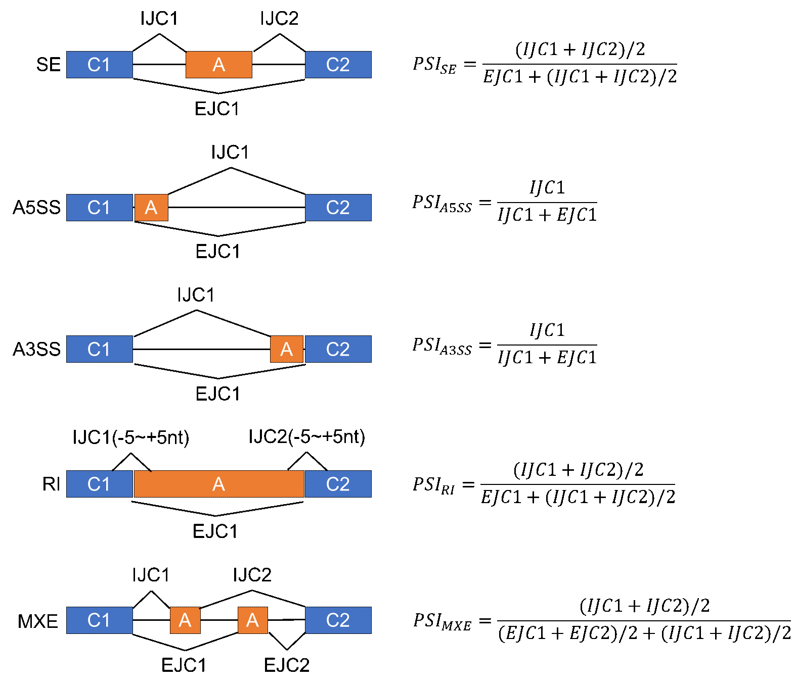

<!-- README.md is generated from README.Rmd. Please edit that file -->

```{r, include = FALSE}
knitr::opts_chunk$set(
  collapse = TRUE,
  comment = "#>",
  fig.path = "man/figures/README-",
  out.width = "100%"
)
```

# SCSES

<!-- badges: start -->

<!-- badges: end -->

Single-cell Splicing Estimation based on Network Diffusion

## Hardware requirements

`SCSES` package requires only a standard computer with enough RAM to support the in-memory operations.

## Software requirements

### OS Requirements

This package is supported for Linux. The package has been tested on Debian-11.21.

## Installation

### Installation of dependencies and requirements

We recommend a new **conda** environment to install SCSES:

``` bash
conda create -n SCSES_test python=3.11
conda activate SCSES_test
```

To use SCSES, you will need to install R, Python, MCR, and Java.

``` bash
## install R in conda environment
conda install -c conda-forge r-base=4.3.1
## install MCR
mkdir /path/to/MCR && \
cd /path/to/MCR && \
wget https://ssd.mathworks.com/supportfiles/downloads/R2022b/Release/10/deployment_files/installer/complete/glnxa64/MATLAB_Runtime_R2022b_Update_10_glnxa64.zip && \
unzip -q MATLAB_Runtime_R2022b_Update_10_glnxa64.zip && \
./install -destinationFolder /opt/mcr -agreeToLicense yes -mode silent
```

#### 1. python module

``` bash
pip install pandas numpy scipy scikit-learn
pip install keras==2.15.0
pip install tensorflow==2.15.0.post1
```

#### 2. Softwares

To detect splicing events You will need to install rMATS, MAJIQ, IRFinder. rMATS should be built in the same environment with SCSES (same python). MAJIQ should be built in a new environment due to conflict of python package version，

##### 2.1 [rMATS](https://github.com/Xinglab/rmats-turbo)

``` bash
wget https://github.com/Xinglab/rmats-turbo/releases/download/v4.3.0/rmats_turbo_v4_3_0.tar.gz
tar -zxvf rmats_turbo_v4_3_0.tar.gz
cd rmats_turbo_v4_3_0/
pip install Cython
./build_rmats
export PATH=/path/to/rmats_turbo_v4_3_0/:$PATH
```

##### 2.2 [MAJIQ](https://biociphers.bitbucket.io/majiq-docs/index.html)

``` bash
conda create -n MAJIQ python=3.11
conda activate MAJIQ
pip install git+https://bitbucket.org/biociphers/majiq_academic.git
export MAJIQ_LICENSE_FILE=/path/to/majiq_license_academic_official.lic
```

**NOTE:** MAJIQ will not function without providing the license file.

##### 2.3 [IRFinder](https://github.com/dgaolab/IRFinder)

``` bash
wget https://github.com/dgaolab/IRFinder/archive/refs/tags/v1.3.1.tar.gz
tar -zxvf v1.3.0.tar.gz
export PATH=/path/to/IRFinder-1.3.0/bin/:$PATH
```

**NOTE:** [STAR](https://github.com/alexdobin/STAR) is required to build IRFinder reference! To run IRFinder correctly, you also need to install STAR.

##### 2.4 [samtools](https://github.com/samtools/samtools)

### Installation of SCSES

Currently SCSES can only be installed from GitHub. To install SCSES, type the following command in **R**:

``` r
options(download.file.method = "wget", times=100)
remotes::install_github("lvxuan12/SCSES")
```

#### Tips for some Installation errors

##### 1. cannot find fftw.h

``` bash
conda install conda-forge::fftw
```

##### 2. cannot find -lxml2

``` bash
conda install conda-forge::libxml2
```

##### 3. cannot find -lsz

``` bash
ln -s /usr/lib/x86_64-linux-gnu/libsz.so /path/to/miniconda/envs/SCSES_test/lib/libsz.so
```

## SCSES input

SCSES requires five inputs from the user

##### 1. bam files sorted by coordinate and index

##### 2. genome FASTA file and annotation GTF and GFF3 file

##### 3. configure file

A configure file is required to run SCSES. You can use `createConfigshiny` command to generate a configure file:

``` r
library(SCSES)
createConfigshiny(host, port) 
```

After running this command, a interactive window will popup which allow you to fill some parameters, such as Bam File Path, and Work Path. For a detailed explanation of the configuration file, please refer to the `config_anno.txt`.

Finally, you can click "Create Config" button and a json file will be generated in the `work_path` you provided if successful.

##### 4. phast conservation file in bigWig format

For human and mouse, you could download it directly from UCSC browser: [mm10.60way.phastCons.bw](http://hgdownload.cse.ucsc.edu/goldenPath/mm10/phastCons60way/), [hg38.phastCons100way.bw](http://hgdownload.cse.ucsc.edu/goldenPath/hg38/phastCons100way/) and [hg19.100way.phastCons.bw](http://hgdownload.cse.ucsc.edu/goldenPath/hg19/phastCons100way/).

##### 5. RBP

Genes annotated as RBP are required to constructs similarity networks. For human and mouse, you could read from `extdata/rbp`.

```{r}
library(SCSES)
# human
rbp = system.file("extdata/rbp/human_rbp.txt",package = "SCSES")
rbp <- readLines(rbp)
rbp[1:10]
```

## Getting started

### Step0. Download and prepare test data

The **test bam files** can be downloaded from <https://doi.org/10.5281/zenodo.13943076>. The dataset includes three cell lines (HCT1954, HepG2, and HL-60), with each cell type comprising five cells. The cell identities can be found in `annotation.txt`.

The other input data required for SCSES for the test data can be downloaded from <https://doi.org/10.5281/zenodo.13951695>, including genome FASTA file, annotation GTF and GFF3 file, RBP file,STAR reference, phast conservation file, and configure file.

Move test bam files to directory `bam/`. Move other input data to directory `refgenome/`.

```{bash}
ls /disk/lvxuan/Single-Splicing/result/cell_line/scses_test/bam/
ls /disk/lvxuan/Single-Splicing/result/cell_line/scses_test/refgenome/
```

### Step1. Read configure file

``` r
## Loading packages
library(SCSES)
#paras_file: path to configure file generated in the previous step
paras = readSCSESconfig(paras_file)
```

The `cell_line.json` file is an example configuration file for test data which can be downloaded previously or load from SCSES package [here](https://github.com/lvxuan12/SCSES/blob/main/analysis/cell_line.json). 

For real dataset, users can modify this file to fit their input and software environment or use `createConfigshiny` function to create a new configuration file.

```{r}
## Loading packages
library(SCSES)
#paras_file: path to configure file generated in the previous step
paras = readSCSESconfig(paste0(system.file("analysis", package = "SCSES"),'/cell_line.json'))
names(paras)
print(paras$DataSet)
print(paras$Basic$bam_path)
print(paras$Basic$work_path)
```

### Step2. Get gene expression

#### TPM matrix (for smart-seq2 dataset)

The TPM matrix of gene expression can be obtained by different methods. We use [featureCounts](https://github.com/ShiLab-Bioinformatics/subread) to generate this matrix. You can use `getGeneExpression` to run featureCounts, which will save featureCounts output to `work_path/expr/` and `getEXPmatrix` to generate TPM matrix, which will save gene expression count and TPM matrix to `work_path/rds/`.

``` r
featurecounts.path = getGeneExpression(paras) 
rds.path = getEXPmatrix(paras)
```

```{r}
featurecounts.path = getGeneExpression(paras) 
rds.path = getEXPmatrix(paras)
print(rds.path)
list.files(rds.path)
tpm = readRDS(paste0(rds.path,'/TPM.rds'))
tpm[1:5,1:5]
```

#### Normalized UMI count matrix (for UMI dataset)

You can use `get10XEXPmatrix` to generate Normalized UMI count matrix from 10X CellRanger hdf5 file, which will save normalized UMI count to `work_path/rds/`.

``` r
rds.path = get10XEXPmatrix(paras,expr_path,sample_name)
```

### Step3. Detect splicing events

To define a global set of all splicing events, SCSES firstly merges all bam files from every single cell to construct a pseudo-bulk bam file, and identifies all types of splicing events by conventional algorithms.

#### for smart-seq2 dataset

``` r
pseudobulk.path = createPseudobulk(paras)
event.path = detectEvents(paras,star_ref_path)
```

```{r}
pseudobulk.path = createPseudobulk(paras)
print(pseudobulk.path)
list.files(pseudobulk.path)

#if you meet:
#irfinder: error while loading shared libraries: libboost_iostreams.so.1.71.0: cannot open shared object file: No such file or directory
old.ld=Sys.getenv("LD_LIBRARY_PATH")
Sys.setenv(LD_LIBRARY_PATH = paste0("/disk/lvxuan/lib:", old.ld))
# you can Provide STAR reference to speed up the function
event.path = detectEvents(paras,star_ref_path="/disk/lvxuan/Single-Splicing/result/cell_line/scses_test/refgenome/STAR_Reference")
print(event.path)
list.files(event.path)
## SE events
se.event=readLines(paste0(event.path,'SE.txt'))
print(nrow(se.event))
print(se.event[1])
```

Different types of splicing events will be saved to `work_path/events/`, separately.

#### for UMI dataset

SCSES requires single cell bam files being saved in a directory. For UMI-based dataset, and using CellRanger for data process, the function `split10XBAM` can be used to get single cell bam files.

``` r
# CellRanger_path: directory to CellRanger output
# out_path: directory to save single cell bam
# core: the number of threads
splitbam.path = split10XBAM(CellRanger_path,out_path,core)
# path to single cell bam files should be added to bam_path in configure file

# pseudobulk.path = createPseudobulk(paras)
# It is not necessary to execute `createPseudobulk`, and the `possorted_genome_bam.bam`,`possorted_genome_bam.bam.bai` from `CellRanger_path` can be moved to `work_path/data/all.bam`.
event.path = detectEvents(paras)
```

### Step4. Quantify splicing events

According to splicing events detected in the previous step, SCSES then quantify raw reads associated with these splicing events in each cell, and construct the raw read count matrix and calculate the raw PSI matrix.

The definition of PSI of different AS events: 

``` r
rawrc.path = getRawRC(paras)
rawpsi.path = getRawPSI(paras)
rawrds.path = mergeSplicingValue(paras)
processed.data.path = preprocessEvent(paras)
```

```{r}
rawrc.path = getRawRC(paras)
rawpsi.path = getRawPSI(paras)
rawrds.path = mergeSplicingValue(paras)
processed.data.path = preprocessEvent(paras)
print(rawrds.path)
print(processed.data.path)

## read count for each type of splicing events in each single cell
list.files(rawrc.path,pattern = "*_rjm")
## data for each type of splicing event
rawrc.files = list.files(rawrc.path,pattern = "*_rc.rds")
print(rawrc.files)
rawpsi.files = list.files(rawpsi.path,pattern = "*_psi.rds")
print(rawpsi.files)
## merged raw data
psi = readRDS(paste0(rawrds.path,'/psi.rds'))
print(psi[1:3,1:3])
print(dim(psi))

rc = readRDS(paste0(rawrds.path,'/rc.rds'))
print(rc[1:3,1:3])
print(dim(rc))

event = readRDS(paste0(rawrds.path,'/event.rds'))
print(event[1:3,])

## processed data
psi_processed = readRDS(paste0(processed.data.path,'/psi.rds'))
rc_processed = readRDS(paste0(processed.data.path,'/rc.rds'))
print(dim(psi_processed))
print(dim(rc_processed))

```

Raw read count matrix, PSI matrix, and event annotation will be saved to `work_path/rds/`.Then, data after quality control process will be saved to `work_path/rds_processed/`, which will be used for **subsequent calculations**.

### Step5. Constructs similarity networks

To overcome the high dropout rate and limited read coverage of scRNA-seq techniques, SCSES constructs cell similarity and event similarity networks by K-nearest neighbor algorithm (KNN) to learn information from similar cells/events.

``` r
cellnet.path = getCellSimilarity(paras)
eventnet.path = getEventSimilarity(paras)
```

```{r}
cellnet.path = getCellSimilarity(paras)
eventnet.path = getEventSimilarity(paras)

print(cellnet.path)
cell.similars=readRDS(paste0(cellnet.path,'/cell.similars.rds'))
## three different features can be chosen to quantify cell similarity, including raw event PSI(PSI), and raw junction read counts(RC), and RBP expression(EXP_RBP)
print(names(cell.similars))

print(eventnet.path)
event.similars=readRDS(paste0(eventnet.path,'/event.similars.rds'))
## different splicing event types
print(names(event.similars))

```

A list of event similarity for different types of splicing events will be saved to `work_path/imputation/event_similarity/event.similars.rds`;

A list of different types of cell similarity and a list of the number of neighbors will be saved to rds file to`work_path/imputation/cell_similarity/cell.similars.rds` and `work_path/imputation/cell_similarity/dyk.cell.rds`

#### Parameters used in this step

In this step, some parameters can be adjusted in configure file or the function parameters directly:

For **cell similarity networks**, SCSES can use RBP expressions, Raw read count or Raw PSI to measure cell similarities.

`feature_num`: the number of high variable features for PCA before calculate cell distance.

`rbp`: expression of those RBPs will be used to calculate cell similarity.

`cell_similarity_data`: data used to calculate cell similarity. Choose at least on from EXP_RBP, RC, and PSI.

`distance_method`: method used to calculate distance.

`alpha_cell`: restart probability for random walk.

`decay_cell`: threshold of change in the similarity matrix.

`kcell_max`: Maximum number of neighbors.

`kcell_min`: Minimum number of neighbors.

For **event similarity networks**, Event similarities are defined by the RBP regulatory correlations and an embedding representation by integrating event sequence similarities.

`ae.para`: parameters of encoding sequence features

`rbp`: expression of those RBPs will be used to calculate RBP regulatory correlations.

`kevent`: the number of neighbors

`alpha_event`: restart probability for random walk

`decay_event`: threshold of change in the similarity matrix

### Step6. Imputation

Based on these weighted similarity networks, SCSES next will use three imputation strategies to aggregate the information across similar cells or events to impute read count or PSI value

``` r
Imputed.data.path = ImputationAll(paras)
```

```{r}
Imputed.data.path = ImputationAll(paras)
Imputed_seperated = readRDS(Imputed.data.path)
str(Imputed_seperated,max.level=3)
# explain:
# For example:
# cell/PSI_PSI: PSI value is used to quantify cell-cell splicing similarity. Impute raw PSI with cell similarities.
# cell/PSI_PSI: PSI value is used to quantify cell-cell splicing similarity. Impute raw inclusion and exclusion read counts with cell similarities, and then calculate the imputed PSI.
# cell_event/PSI_PSI: PSI value is used to quantify cell-cell splicing similarity. Impute raw inclusion and exclusion read counts with cell similarities, and then calculate the imputed PSI. Further impute the results using event similarities.
```

Results of each imputation strategy will be saved into`work_path/imputation`.

### Step7. Estimation

We recommend different imputation strategies for four scenarios defined by the abundance of reads counts in the target cell and neighbor cells (ND, BD, TD+Info, and TD-Info). SCSES pre-trains models to predict the probability of specific scenario for each cell-event pair. Finally, SCSES calculates the PSI value using a linear combination of predictions from the four strategies, weighted by these probabilities.

``` r
#rds_imputed_file: path to the list of three imputation strategies results generated in the previous step
Imputed.data.final.path = Estimation(paras,rds_imputed_file = Imputed.data.path)
```

```{r}
#rds_imputed_file: path to the list of three imputation strategies results generated in the previous step
Imputed.data.final.path = Estimation(paras,rds_imputed_file = Imputed.data.path)
Imputed_combined = readRDS(Imputed.data.final.path)
str(Imputed_combined,max.level=2)
# The finally imputed PSI were named by cell-cell splicing similarity features, including raw event PSI(PSI), and raw junction read counts(RC), and RBP expression(EXP_RBP).
```

A list of final imputation of PSI values will be saved by serialized R object format (.rds) in `work_path/imputation/Imputed_combined*`, where **\*** is a random number representing different execution. The `.rds` file can be loaded in R environment by `readRDS` function.

#### Fine-tune the model

To improve the fitness of models for a new dataset, we also provide a procedure to fine-tune the model. For this analysis, we first build a reference using a set of splicing events with conserved splicing levels in different human tissues (<https://zenodo.org/records/6408906>). Then we compare the splicing level in a new dataset with the reference records, and give the scenarios definition to each event-cell pair, which is used to fine-tune the pre-trained model.

The commands to perform these analyses:

``` r
ftrc.path = getFtRawRC(paras)
ftpsi.path = getFtRawPSI(paras)
ftrds.path = mergeFtSplicingValue(paras)
ftmodel.path = FtClassifier(paras)
#rds_imputed_file: path to the list of three imputation strategies results generated in the previous step
ImputedFt.data.final.path = Estimation(paras,rds_imputed_file = Imputed.data.path)
```

```{r}
ftrc.path = getFtRawRC(paras)
ftpsi.path = getFtRawPSI(paras)
ftrds.path = mergeFtSplicingValue(paras)
ftmodel.path = FtClassifier(paras)
#rds_imputed_file: path to the list of three imputation strategies results generated in the previous step
ImputedFt.data.final.path = Estimation(paras,rds_imputed_file = Imputed.data.path)

print(ImputedFt.data.final.path)
```

The final imputation results can be loaded by:

```{r}
Imputed_combined = readRDS(ImputedFt.data.final.path)
Imputed_combined[["EXP_RBP"]][1:3,1:3]
```

The reference results of the test data can be found [here](https://github.com/lvxuan12/SCSES/blob/main/analysis/Imputed_combined_499988896.rds), or loaded by command:

``` r
ref.path <- paste0(system.file("analysis", package = "SCSES"),'/Imputed_combined_499988896.rds')
ref.result <- readRDS(ref.path)
```

### Step8. Cell Clustering

```{r}
library(umap)
library(ggplot2)
calcu_umap<-function(data,n_neighbors){
  set.seed(12345)
  data = data[which(apply(data, 1, mean) != 0), ]
  data = data[which(apply(data, 1, var) != 0), ]
  D_Reduct_res <- prcomp(t(data), center = T, scale. = T)
  sdev <- D_Reduct_res$sdev
  var_prop <- sdev^2 / sum(sdev^2)
  cumulative_variance <- cumsum(var_prop)
  n_components <- which(cumulative_variance >= 0.7)[1]
  D_Reduct <- D_Reduct_res$x[, 1:n_components]
  umap_res <- umap::umap(D_Reduct,n_neighbors = n_neighbors)
  input <- umap_res$layout
  df<-as.data.frame(input)
  row.names(df)<-colnames(data)
  return(df)
}

mycol=c("#fbb45d","#699ed4","#ef8183")
annotation=read.table(paste0(system.file("analysis", package = "SCSES"),'/cell_line_annotation.txt'),sep="\t")
Imputed_combined=readRDS(paste0(system.file("analysis", package = "SCSES"),'/Imputed_combined_499988896.rds'))
data_umap=calcu_umap(Imputed_combined[[3]],n_neighbors = 5)
row.names(data_umap)=gsub(".bam","",row.names(data_umap))
data_umap$group=annotation$V2[match(row.names(data_umap),annotation$V1)]

p=ggplot(data = data_umap,aes(x =V1 ,y =V2))+
    geom_point(aes(fill=group),shape=21,size=1.5,stroke=0.05)+
    scale_fill_manual(values = mycol)+
    xlab("UMAP1")+
    ylab("UMAP2")

print(p)
```
