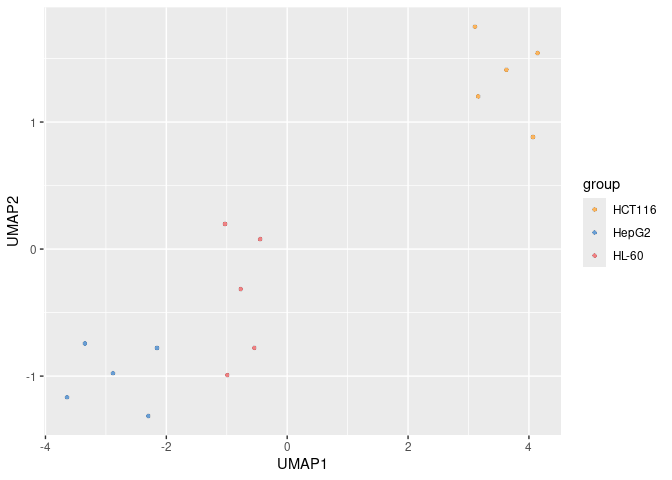

Menu
================

- [SCSES](#scses)
  - [Installation](#installation)
    - [Installation of dependencies and
      requirements](#installation-of-dependencies-and-requirements)
      - [1. python module](#1-python-module)
      - [2. Softwares](#2-softwares)
    - [Installation of SCSES](#installation-of-scses)
      - [Tips for some Installation
        errors](#tips-for-some-installation-errors)
  - [SCSES input](#scses-input)
  - [Getting started](#getting-started)
    - [Step0. Download and prepare test
      data](#step0-download-and-prepare-test-data)
    - [Step1. Read configure file](#step1-read-configure-file)
    - [Step2. Get gene expression](#step2-get-gene-expression)
      - [TPM matrix (for smart-seq2
        dataset)](#tpm-matrix-for-smart-seq2-dataset)
      - [Normalized UMI count matrix (for UMI
        dataset)](#normalized-umi-count-matrix-for-umi-dataset)
    - [Step3. Detect splicing events](#step3-detect-splicing-events)
      - [for smart-seq2 dataset](#for-smart-seq2-dataset)
      - [for UMI dataset](#for-umi-dataset)
    - [Step4. Quantify splicing events](#step4-quantify-splicing-events)
    - [Step5. Constructs similarity
      networks](#step5-constructs-similarity-networks)
      - [Parameters used in this step](#parameters-used-in-this-step)
    - [Step6. Imputation](#step6-imputation)
    - [Step7. Estimation](#step7-estimation)
      - [Fine-tune the model](#fine-tune-the-model)
    - [Step8. Cell Clustering](#step8-cell-clustering)
  - [Example](#example)

<!-- README.md is generated from README.Rmd. Please edit that file -->

# SCSES

<!-- badges: start -->

<!-- badges: end -->

Single-cell Splicing Estimation based on Network Diffusion

## Installation

### Installation of dependencies and requirements

We recommend a new **conda** environment to install SCSES:

``` bash
conda create -n SCSES_test python=3.11
conda activate SCSES_test
```

To use SCSES, you will need to install R, Python, Matlab, and Java.

``` bash
conda install -c conda-forge r-base=4.3.1
```

#### 1. python module

``` bash
pip install pandas numpy scipy scikit-learn
pip install keras==2.15.0
pip install tensorflow==2.15.0.post1
```

#### 2. Softwares

To detect splicing events You will need to install rMATS, MAJIQ,
IRFinder. rMATS should be built in the same environment with SCSES (same
python). MAJIQ should be built in a new environment due to conflict of
python package version，

##### 2.1 [rMATS](https://github.com/Xinglab/rmats-turbo)

``` bash
wget https://github.com/Xinglab/rmats-turbo/releases/download/v4.3.0/rmats_turbo_v4_3_0.tar.gz
tar -zxvf rmats_turbo_v4_3_0.tar.gz
pip install Cython
./build_rmats
export PATH=/path/to/rmats_turbo_v4_3_0/:$PATH
```

##### 2.2 [MAJIQ](https://biociphers.bitbucket.io/majiq-docs/index.html)

``` bash
conda create -n MAJIQ python=3.11
conda activate MAJIQ
pip install git+https://bitbucket.org/biociphers/majiq_academic.git
export MAJIQ_LICENSE_FILE=/path/to/majiq_license_academic_official.lic
```

**NOTE:** MAJIQ will not function without providing the license file.

##### 2.3 [IRFinder](https://github.com/dgaolab/IRFinder)

``` bash
wget https://github.com/RitchieLabIGH/IRFinder/archive/refs/tags/v2.0.1.tar.gz
tar -zxvf v1.3.0.tar.gz
export PATH=/path/to/IRFinder-2.0.1/bin/:$PATH
```

**NOTE:** [STAR](https://github.com/alexdobin/STAR) is required to build
IRFinder reference! To run IRFinder correctly, you also need to install
STAR.

##### 2.4 [samtools](https://github.com/samtools/samtools)

### Installation of SCSES

Currently SCSES can only be installed from GitHub. To install SCSES,
type the following command in **R**:

``` r
options(download.file.method = "wget", times=100)
remotes::install_github("lvxuan12/SCSES")
```

#### Tips for some Installation errors

##### 1. cannot find fftw.h

``` bash
conda install conda-forge::fftw
```

##### 2. cannot find -lxml2

``` bash
conda install conda-forge::libxml2
```

##### 3. cannot find -lsz

``` bash
ln -s /usr/lib/x86_64-linux-gnu/libsz.so /path/to/miniconda/envs/SCSES_test/lib/libsz.so
```

## SCSES input

SCSES requires five inputs from the user

##### 1. bam files sorted by coordinate and index

##### 2. genome FASTA file and annotation GTF and GFF3 file

##### 3. configure file

A configure file is required to run SCSES. You can use
`createConfigshiny` command to generate a configure file:

``` r
library(SCSES)
createConfigshiny(host, port) 
```

After running this command, a interactive window will popup which allow
you to fill some parameters, such as Bam File Path, and Work Path. For a
detailed explanation of the configuration file, please refer to the
`config_anno.txt`.

Finally, you can click “Create Config” button and a json file will be
generated in the `work_path` you provided if successful.

##### 4. phast conservation file in bigWig format

For human and mouse, you could download it directly from UCSC browser:
[mm10.60way.phastCons.bw](http://hgdownload.cse.ucsc.edu/goldenPath/mm10/phastCons60way/),
[hg38.phastCons100way.bw](http://hgdownload.cse.ucsc.edu/goldenPath/hg38/phastCons100way/)
and
[hg19.100way.phastCons.bw](http://hgdownload.cse.ucsc.edu/goldenPath/hg19/phastCons100way/).

##### 5. RBP

Genes annotated as RBP are required to constructs similarity networks.
For human and mouse, you could read from `extdata/rbp`.

``` r
library(SCSES)
#> Loading required package: BiocManager
#> Bioconductor version '3.16' is out-of-date; the current release version '3.19'
#>   is available with R version '4.4'; see https://bioconductor.org/install
#> Warning: replacing previous import 'hdf5r::h5const' by 'rhdf5::h5const' when
#> loading 'SCSES'
#> Warning: replacing previous import 'hdf5r::h5version' by 'rhdf5::h5version'
#> when loading 'SCSES'
#> Warning: replacing previous import 'fs::path' by 'rtracklayer::path' when
#> loading 'SCSES'
#> Warning: replacing previous import 'hdf5r::values' by 'rtracklayer::values'
#> when loading 'SCSES'
# human
rbp = system.file("extdata/rbp/human_rbp.txt",package = "SCSES")
rbp <- readLines(rbp)
rbp[1:10]
#>  [1] "A1CF"       "AC004381.6" "ACIN1"      "ACO1"       "AKAP1"     
#>  [6] "ALKBH8"     "ALYREF"     "ANKHD1"     "ANKRD17"    "APTX"
```

## Getting started

### Step0. Download and prepare test data

The **test bam files** can be downloaded from
<https://doi.org/10.5281/zenodo.13943076>. The dataset includes three
cell lines (HCT1954, HepG2, and HL-60), with each cell type comprising
five cells. The cell identities can be found in `annotation.txt`.

The other input data required for SCSES for the test data can be
downloaded from <https://doi.org/10.5281/zenodo.13951696>, including
genome FASTA file, annotation GTF and GFF3 file, RBP file,STAR
reference, phast conservation file, and configure file.

Move test bam files to directory bam/. Move other input data to
directory refgenome/.

``` bash
ls /disk/lvxuan/Single-Splicing/result/cell_line/scses_test/bam/
ls /disk/lvxuan/Single-Splicing/result/cell_line/scses_test/refgenome/
#> SRR11826368.bam
#> SRR11826368.bam.bai
#> SRR11826371.bam
#> SRR11826371.bam.bai
#> SRR11826409.bam
#> SRR11826409.bam.bai
#> SRR11826436.bam
#> SRR11826436.bam.bai
#> SRR11826437.bam
#> SRR11826437.bam.bai
#> SRR11826440.bam
#> SRR11826440.bam.bai
#> SRR11826455.bam
#> SRR11826455.bam.bai
#> SRR11826458.bam
#> SRR11826458.bam.bai
#> SRR11826464.bam
#> SRR11826464.bam.bai
#> SRR11826470.bam
#> SRR11826470.bam.bai
#> SRR1275148.bam
#> SRR1275148.bam.bai
#> SRR1275150.bam
#> SRR1275150.bam.bai
#> SRR1275227.bam
#> SRR1275227.bam.bai
#> SRR1275305.bam
#> SRR1275305.bam.bai
#> SRR1275317.bam
#> SRR1275317.bam.bai
#> STAR_Reference
#> annotation.txt
#> cell_line.json
#> hg19.100way.phastCons.bw
#> human_rbp.txt
#> test.fa
#> test.fa.fai
#> test.gff3
#> test.gtf
```

### Step1. Read configure file

``` r
library(SCSES)
#paras_file: path to configure file generated in the previous step
paras = readSCSESconfig(paras_file)
```

The `cell_line.json` file downloaded previously is an example
configuration file for test data. Users can modify this file or use
`createConfigshiny` function to create a new configuration file.

``` r
## Loading packages
library(SCSES)
#paras_file: path to configure file generated in the previous step
paras = readSCSESconfig('/disk/lvxuan/Single-Splicing/result/cell_line/scses_test/refgenome/cell_line.json')
names(paras)
#> [1] "DataSet" "Basic"   "Task"
print(paras$DataSet)
#> [1] "cell_line"
print(paras$Basic$bam_path)
#> [1] "/disk/lvxuan/Single-Splicing/result/cell_line/scses_test/bam"
print(paras$Basic$work_path)
#> [1] "/disk/lvxuan/Single-Splicing/result/cell_line/scses_test"
```

### Step2. Get gene expression

#### TPM matrix (for smart-seq2 dataset)

The TPM matrix of gene expression can be obtained by different methods.
We use [featureCounts](https://github.com/ShiLab-Bioinformatics/subread)
to generate this matrix. You can use `getGeneExpression` to run
featureCounts, which will save featureCounts output to `work_path/expr/`
and `getEXPmatrix` to generate TPM matrix, which will save gene
expression count and TPM matrix to `work_path/rds/`.

``` r
featurecounts.path = getGeneExpression(paras) 
#> [1] "[2024-10-21 22:10:08] Detect gene expression: bash /tmp/RtmpzZeF7E/temp_libpath367f3121f64351/SCSES/shell/run_featurecounts.sh /disk/lvxuan/Single-Splicing/result/cell_line/scses_test/expr/ /disk/lvxuan/Single-Splicing/result/cell_line/scses_test/refgenome/test.fa /disk/lvxuan/Single-Splicing/result/cell_line/scses_test/refgenome/test.gtf /disk/lvxuan/Single-Splicing/result/cell_line/scses_test/bam 20 cell_line paired /disk/software/subread-2.0.6-source/bin/featureCounts >> /disk/lvxuan/Single-Splicing/result/cell_line/scses_test/runfeatureCounts.log 2>&1"
#> [1] "[2024-10-21 22:10:27] Detect gene expression Finish."
rds.path = getEXPmatrix(paras)
print(rds.path)
#> [1] "/disk/lvxuan/Single-Splicing/result/cell_line/scses_test/rds/"
list.files(rds.path)
#> [1] "count.rds" "event.rds" "psi.rds"   "rc.rds"    "TPM.rds"
```

``` r

tpm = readRDS(paste0(rds.path,'/TPM.rds'))
tpm[1:5,1:5]
#>            SRR11826368.bam SRR11826371.bam SRR11826409.bam SRR11826436.bam
#> DDX11L1           0.000000        0.000000        0.000000               0
#> WASH7P            2.215639        2.618154        4.034029               0
#> MIR1302-11        0.000000        0.000000        0.000000               0
#> FAM138A           0.000000        0.000000        0.000000               0
#> OR4G4P            0.000000        0.000000        0.000000               0
#>            SRR11826437.bam
#> DDX11L1                  0
#> WASH7P                   0
#> MIR1302-11               0
#> FAM138A                  0
#> OR4G4P                   0
```

#### Normalized UMI count matrix (for UMI dataset)

You can use `get10XEXPmatrix` to generate Normalized UMI count matrix
from 10X CellRanger hdf5 file, which will save normalized UMI count to
`work_path/rds/`.

``` r
rds.path = get10XEXPmatrix(paras,expr_path,sample_name)
```

### Step3. Detect splicing events

To define a global set of all splicing events, SCSES firstly merges all
bam files from every single cell to construct a pseudo-bulk bam file,
and identifies all types of splicing events by conventional algorithms.

#### for smart-seq2 dataset

``` r
pseudobulk.path = createPseudobulk(paras)
#> [1] "Input: /disk/lvxuan/Single-Splicing/result/cell_line/scses_test/bam"
#> [1] "Output: /disk/lvxuan/Single-Splicing/result/cell_line/scses_test/data/"
#> [1] "[2024-10-21 22:10:27] Creating Pseudobulk directory..."
#> Warning in dir.create(path = pseudobulk.path, recursive = T):
#> '/disk/lvxuan/Single-Splicing/result/cell_line/scses_test/data' already exists
#> [1] "Pseudobulk bam file exists."
#> [1] "[2024-10-21 22:10:27] Merge Bam Files: /disk/software/samtools/bin/samtools merge -f -@ 20 /disk/lvxuan/Single-Splicing/result/cell_line/scses_test/data//all.bam /disk/lvxuan/Single-Splicing/result/cell_line/scses_test/bam/*.bam --no-PG"
#> [1] "[2024-10-21 22:11:08] Merge Bam Files Finish."
#> [1] "[2024-10-21 22:11:08] Bam File Index: /disk/software/samtools/bin/samtools index -@ 20 /disk/lvxuan/Single-Splicing/result/cell_line/scses_test/data//all.bam"
#> [1] "[2024-10-21 22:11:14] Bam File Index Finish."
print(pseudobulk.path)
#> [1] "/disk/lvxuan/Single-Splicing/result/cell_line/scses_test/data/"
list.files(pseudobulk.path)
#> [1] "all.bam"     "all.bam.bai"

#if you meet:
#irfinder: error while loading shared libraries: libboost_iostreams.so.1.71.0: cannot open shared object file: No such file or directory
old.ld=Sys.getenv("LD_LIBRARY_PATH")
Sys.setenv(LD_LIBRARY_PATH = paste0("/disk/lvxuan/lib:", old.ld))
# you can Provide STAR reference to speed up the function
event.path = detectEvents(paras,star_ref_path="/disk/lvxuan/Single-Splicing/result/cell_line/scses_test/refgenome/STAR_Reference")
#> [1] "Checking cells..."
#> [1] "Checking events..."
#> [1] "event_type=SE;RI;A3SS;A5SS;MXE  checked"
#> [1] "Output: /disk/lvxuan/Single-Splicing/result/cell_line/scses_test/events/"
#> [1] "[2024-10-21 22:11:14] Creating events directory..."
#> Warning in dir.create(path = work_path):
#> '/disk/lvxuan/Single-Splicing/result/cell_line/scses_test/events' already
#> exists
#> [1] "[2024-10-21 22:11:14] Generating SE event id"
#> arguments 'show.output.on.console', 'minimized' and 'invisible' are for Windows only
#> [1] "[2024-10-21 22:11:14] Generating SE event id Finish."
#> [1] "[2024-10-21 22:11:14] Generating RI event id"
#> arguments 'show.output.on.console', 'minimized' and 'invisible' are for Windows only
#> [1] "[2024-10-21 22:11:29] Generating RI event id Finish."
#> [1] "[2024-10-21 22:11:29] Generating A3SS event id"
#> [1] "[2024-10-21 22:11:29] Generating A3SS event id Finish."
#> [1] "[2024-10-21 22:11:29] Generating A5SS event id"
#> [1] "[2024-10-21 22:11:30] Generating A5SS event id Finish."
#> [1] "[2024-10-21 22:11:30] Generating MXE event id"
#> [1] "[2024-10-21 22:11:30] Generating MXE event id Finish."
#> [1] "Total splicing event: SE=5764 RI=582 A3SS=237 A5SS=231 MXE=349"
print(event.path)
#> [1] "/disk/lvxuan/Single-Splicing/result/cell_line/scses_test/events/"
list.files(event.path)
#>  [1] "A3SS.txt"            "A5SS.txt"            "IRFinder"           
#>  [4] "java_getRC_A3SS.log" "java_getRC_A5SS.log" "java_getRC_MXE.log" 
#>  [7] "java_getRC_RI.log"   "java_getRC_SE.log"   "majiq"              
#> [10] "MXE.txt"             "RI.txt"              "rMats"              
#> [13] "SE.txt"
```

Different types of splicing events will be saved to `work_path/events/`,
separately.

``` r
se.event=readLines(paste0(event.path,'SE.txt'))
print(nrow(se.event))
#> NULL
print(se.event[1])
#> [1] "isoform1=exon:chr5:180219870-180220097:-@junction:chr5:180220098-180229679:-@exon:chr5:180229680-180229803:-|isoform2=junction:chr5:180220098-180222655:-@exon:chr5:180222656-180222875:-@junction:chr5:180222876-180229679:-|MGAT1|SE"
```

#### for UMI dataset

SCSES requires single cell bam files being saved in a directory. For
UMI-based dataset, and using CellRanger for data process, the function
`split10XBAM` can be used to get single cell bam files.

``` r
# CellRanger_path: directory to CellRanger output
# out_path: directory to save single cell bam
# core: the number of threads
splitbam.path = split10XBAM(CellRanger_path,out_path,core)
# path to single cell bam files should be added to bam_path in configure file

# pseudobulk.path = createPseudobulk(paras)
# It is not necessary to execute `createPseudobulk`, and the `possorted_genome_bam.bam`,`possorted_genome_bam.bam.bai` from `CellRanger_path` can be moved to `work_path/data/all.bam`.
event.path = detectEvents(paras)
```

### Step4. Quantify splicing events

According to splicing events detected in the previous step, SCSES then
quantify raw reads associated with these splicing events in each cell,
and construct the raw read count matrix and calculate the raw PSI
matrix.

The definition of PSI of different AS events: 

``` r
rawrc.path = getRawRC(paras)
#> [1] "Checking events..."
#> [1] "event_type=A3SS;A5SS;MXE;RI;SE  checked"
#> [1] "Checking cells..."
#> [1] "15 cells are considered."
#> [1] "Output: /disk/lvxuan/Single-Splicing/result/cell_line/scses_test/splicing_value/"
#> [1] "Splicing event types: A3SS A5SS MXE RI SE"
#> [1] "[2024-10-21 22:11:30] Counting reads of A3SS events..."
#> Warning in dir.create(outpath_per_cell):
#> '/disk/lvxuan/Single-Splicing/result/cell_line/scses_test/splicing_value//A3SS_rjm'
#> already exists
#> [1] "Reading RJC File Progress: 0%"
#> [1] "Reading RJC File Progress: 10%"
#> [1] "Reading RJC File Progress: 20%"
#> [1] "Reading RJC File Progress: 30%"
#> [1] "Reading RJC File Progress: 40%"
#> [1] "Reading RJC File Progress: 50%"
#> [1] "Reading RJC File Progress: 60%"
#> [1] "Reading RJC File Progress: 70%"
#> [1] "Reading RJC File Progress: 80%"
#> [1] "Reading RJC File Progress: 90%"
#> [1] "Reading RJC File Progress: 100%"
#> [1] "[2024-10-21 22:11:33] Counting reads of A3SS events Finish."
#> [1] "[2024-10-21 22:11:33] Counting reads of A5SS events..."
#> Warning in dir.create(outpath_per_cell):
#> '/disk/lvxuan/Single-Splicing/result/cell_line/scses_test/splicing_value//A5SS_rjm'
#> already exists
#> [1] "Reading RJC File Progress: 0%"
#> [1] "Reading RJC File Progress: 10%"
#> [1] "Reading RJC File Progress: 20%"
#> [1] "Reading RJC File Progress: 30%"
#> [1] "Reading RJC File Progress: 40%"
#> [1] "Reading RJC File Progress: 50%"
#> [1] "Reading RJC File Progress: 60%"
#> [1] "Reading RJC File Progress: 70%"
#> [1] "Reading RJC File Progress: 80%"
#> [1] "Reading RJC File Progress: 90%"
#> [1] "Reading RJC File Progress: 100%"
#> [1] "[2024-10-21 22:11:35] Counting reads of A5SS events Finish."
#> [1] "[2024-10-21 22:11:35] Counting reads of MXE events..."
#> Warning in dir.create(outpath_per_cell):
#> '/disk/lvxuan/Single-Splicing/result/cell_line/scses_test/splicing_value//MXE_rjm'
#> already exists
#> [1] "Reading RJC File Progress: 0%"
#> [1] "Reading RJC File Progress: 10%"
#> [1] "Reading RJC File Progress: 20%"
#> [1] "Reading RJC File Progress: 30%"
#> [1] "Reading RJC File Progress: 40%"
#> [1] "Reading RJC File Progress: 50%"
#> [1] "Reading RJC File Progress: 60%"
#> [1] "Reading RJC File Progress: 70%"
#> [1] "Reading RJC File Progress: 80%"
#> [1] "Reading RJC File Progress: 90%"
#> [1] "Reading RJC File Progress: 100%"
#> [1] "[2024-10-21 22:11:40] Counting reads of MXE events Finish."
#> [1] "[2024-10-21 22:11:40] Counting reads of RI events..."
#> Warning in dir.create(outpath_per_cell):
#> '/disk/lvxuan/Single-Splicing/result/cell_line/scses_test/splicing_value//RI_rjm'
#> already exists
#> [1] "Reading RJC File Progress: 0%"
#> [1] "Reading RJC File Progress: 10%"
#> [1] "Reading RJC File Progress: 10%"
#> [1] "Reading RJC File Progress: 20%"
#> [1] "Reading RJC File Progress: 20%"
#> [1] "Reading RJC File Progress: 30%"
#> [1] "Reading RJC File Progress: 40%"
#> [1] "Reading RJC File Progress: 40%"
#> [1] "Reading RJC File Progress: 50%"
#> [1] "Reading RJC File Progress: 60%"
#> [1] "Reading RJC File Progress: 60%"
#> [1] "Reading RJC File Progress: 70%"
#> [1] "Reading RJC File Progress: 80%"
#> [1] "Reading RJC File Progress: 80%"
#> [1] "Reading RJC File Progress: 90%"
#> [1] "Reading RJC File Progress: 90%"
#> [1] "Reading RJC File Progress:100%"
#> [1] "[2024-10-21 22:11:48] Counting reads of RI events Finish."
#> [1] "[2024-10-21 22:11:48] Counting reads of SE events..."
#> Warning in dir.create(outpath_per_cell):
#> '/disk/lvxuan/Single-Splicing/result/cell_line/scses_test/splicing_value//SE_rjm'
#> already exists
#> [1] "Reading RJC File Progress: 0%"
#> [1] "Reading RJC File Progress: 10%"
#> [1] "Reading RJC File Progress: 20%"
#> [1] "Reading RJC File Progress: 30%"
#> [1] "Reading RJC File Progress: 40%"
#> [1] "Reading RJC File Progress: 50%"
#> [1] "Reading RJC File Progress: 60%"
#> [1] "Reading RJC File Progress: 70%"
#> [1] "Reading RJC File Progress: 80%"
#> [1] "Reading RJC File Progress: 90%"
#> [1] "Reading RJC File Progress: 100%"
#> [1] "[2024-10-21 22:12:16] Counting reads of SE events Finish."
rawpsi.path = getRawPSI(paras)
#> [1] "Checking raw reads..."
#> [1] "Checking events..."
#> [1] "event_type=A3SS;A5SS;MXE;RI;SE  checked"
#> [1] "[2024-10-21 22:12:16] Calculating PSI value of A3SS events..."
#> [1] "[2024-10-21 22:12:16] Calculating PSI value of A3SS events Finish."
#> [1] "[2024-10-21 22:12:16] Calculating PSI value of A5SS events..."
#> [1] "[2024-10-21 22:12:16] Calculating PSI value of A5SS events Finish."
#> [1] "[2024-10-21 22:12:16] Calculating PSI value of MXE events..."
#> [1] "[2024-10-21 22:12:16] Calculating PSI value of MXE events Finish."
#> [1] "[2024-10-21 22:12:16] Calculating PSI value of RI events..."
#> [1] "[2024-10-21 22:12:16] Calculating PSI value of RI events Finish."
#> [1] "[2024-10-21 22:12:16] Calculating PSI value of SE events..."
#> [1] "[2024-10-21 22:12:16] Calculating PSI value of SE events Finish."
rawrds.path = mergeSplicingValue(paras)
processed.data.path = preprocessEvent(paras)
#> [1] "[2024-10-21 22:12:17] Processing raw data..."
#> [1] "Input: /disk/lvxuan/Single-Splicing/result/cell_line/scses_test/rds/"
#> [1] "Output: /disk/lvxuan/Single-Splicing/result/cell_line/scses_test/rds_processed/"
#> [1] "Before filtering"
#> [1] "expr: 17103*15"
#> [1] "psi: 7149*16"
#> [1] "rc: 16049*16"
#> [1] "Cell ids of raw data is mismatch! The insection of cells will be used to further analysis."
#> [1] "After filtering"
#> [1] "expr: 5669*15"
#> [1] "psi: 2550*15"
#> [1] "rc: 6087*15"
#> [1] "[2024-10-21 22:12:18] Successfully processed data."
print(rawrds.path)
#> [1] "/disk/lvxuan/Single-Splicing/result/cell_line/scses_test/rds/"
print(processed.data.path)
#> [1] "/disk/lvxuan/Single-Splicing/result/cell_line/scses_test/rds_processed/"
```

Raw read count matrix, PSI matrix, and event annotation will be saved to
`work_path/rds/`.Then, data after quality control process will be saved
to `work_path/rds_processed/`, which will be used for **subsequent
calculations**.

``` r
## read count for each type of splicing events in each single cell
list.files(rawrc.path,pattern = "*_rjm")
#> [1] "A3SS_rjm" "A5SS_rjm" "MXE_rjm"  "RI_rjm"   "SE_rjm"
## data for each type of splicing event
rawrc.files = list.files(rawrc.path,pattern = "*_rc.rds")
print(rawrc.files)
#> [1] "A3SS_rc.rds" "A5SS_rc.rds" "MXE_rc.rds"  "RI_rc.rds"   "SE_rc.rds"
rawpsi.files = list.files(rawpsi.path,pattern = "*_psi.rds")
print(rawpsi.files)
#> [1] "A3SS_psi.rds" "A5SS_psi.rds" "MXE_psi.rds"  "RI_psi.rds"   "SE_psi.rds"
## merged data
psi = readRDS(paste0(rawrds.path,'/psi.rds'))
print(psi[1:3,1:3])
#>                                                                                                                                                                                                                                       SRR11826368.bam
#> isoform1=exon:chr4:146019084-146019571:+@junction:chr4:146019572-146025540:+@exon:chr4:146025541-146025667:+|isoform2=exon:chr4:146019084-146019571:+@junction:chr4:146019572-146025537:+@exon:chr4:146025538-146025667:+|ABCE1|A3SS        0.8888889
#> isoform1=exon:chr2:233599865-233599948:+@junction:chr2:233599949-233600472:+@exon:chr2:233600473-233601358:+|isoform2=exon:chr2:233599865-233599948:+@junction:chr2:233599949-233600462:+@exon:chr2:233600463-233601358:+|GIGYF2|A3SS       0.0000000
#> isoform1=exon:chr2:233651860-233652039:+@junction:chr2:233652040-233655425:+@exon:chr2:233655426-233655625:+|isoform2=exon:chr2:233651860-233652039:+@junction:chr2:233652040-233655407:+@exon:chr2:233655408-233655625:+|GIGYF2|A3SS       1.0000000
#>                                                                                                                                                                                                                                       SRR11826371.bam
#> isoform1=exon:chr4:146019084-146019571:+@junction:chr4:146019572-146025540:+@exon:chr4:146025541-146025667:+|isoform2=exon:chr4:146019084-146019571:+@junction:chr4:146019572-146025537:+@exon:chr4:146025538-146025667:+|ABCE1|A3SS        1.0000000
#> isoform1=exon:chr2:233599865-233599948:+@junction:chr2:233599949-233600472:+@exon:chr2:233600473-233601358:+|isoform2=exon:chr2:233599865-233599948:+@junction:chr2:233599949-233600462:+@exon:chr2:233600463-233601358:+|GIGYF2|A3SS       0.0000000
#> isoform1=exon:chr2:233651860-233652039:+@junction:chr2:233652040-233655425:+@exon:chr2:233655426-233655625:+|isoform2=exon:chr2:233651860-233652039:+@junction:chr2:233652040-233655407:+@exon:chr2:233655408-233655625:+|GIGYF2|A3SS       0.6666667
#>                                                                                                                                                                                                                                       SRR11826409.bam
#> isoform1=exon:chr4:146019084-146019571:+@junction:chr4:146019572-146025540:+@exon:chr4:146025541-146025667:+|isoform2=exon:chr4:146019084-146019571:+@junction:chr4:146019572-146025537:+@exon:chr4:146025538-146025667:+|ABCE1|A3SS        0.8888889
#> isoform1=exon:chr2:233599865-233599948:+@junction:chr2:233599949-233600472:+@exon:chr2:233600473-233601358:+|isoform2=exon:chr2:233599865-233599948:+@junction:chr2:233599949-233600462:+@exon:chr2:233600463-233601358:+|GIGYF2|A3SS       0.0000000
#> isoform1=exon:chr2:233651860-233652039:+@junction:chr2:233652040-233655425:+@exon:chr2:233655426-233655625:+|isoform2=exon:chr2:233651860-233652039:+@junction:chr2:233652040-233655407:+@exon:chr2:233655408-233655625:+|GIGYF2|A3SS       0.9230769
print(dim(psi))
#> [1] 7149   16

rc = readRDS(paste0(rawrds.path,'/rc.rds'))
print(rc[1:3,1:3])
#>                                     SRR11826368.bam SRR11826371.bam
#> junction:chr4:146019572-146025540:+               2               0
#> junction:chr2:233599949-233600472:+               0               0
#> junction:chr2:233652040-233655425:+               0               2
#>                                     SRR11826409.bam
#> junction:chr4:146019572-146025540:+               1
#> junction:chr2:233599949-233600472:+               0
#> junction:chr2:233652040-233655425:+               1
print(dim(rc))
#> [1] 16049    16

event = readRDS(paste0(rawrds.path,'/event.rds'))
print(event[1:3,])
#>                                                                                                                                                                                                                                   event
#> 1  isoform1=exon:chr4:146019084-146019571:+@junction:chr4:146019572-146025540:+@exon:chr4:146025541-146025667:+|isoform2=exon:chr4:146019084-146019571:+@junction:chr4:146019572-146025537:+@exon:chr4:146025538-146025667:+|ABCE1|A3SS
#> 2 isoform1=exon:chr2:233599865-233599948:+@junction:chr2:233599949-233600472:+@exon:chr2:233600473-233601358:+|isoform2=exon:chr2:233599865-233599948:+@junction:chr2:233599949-233600462:+@exon:chr2:233600463-233601358:+|GIGYF2|A3SS
#> 3 isoform1=exon:chr2:233651860-233652039:+@junction:chr2:233652040-233655425:+@exon:chr2:233655426-233655625:+|isoform2=exon:chr2:233651860-233652039:+@junction:chr2:233652040-233655407:+@exon:chr2:233655408-233655625:+|GIGYF2|A3SS
#>                            exclusion1 exclusion2
#> 1 junction:chr4:146019572-146025540:+       <NA>
#> 2 junction:chr2:233599949-233600472:+       <NA>
#> 3 junction:chr2:233652040-233655425:+       <NA>
#>                            retention1 retention2 type
#> 1 junction:chr4:146019572-146025537:+       <NA> A3SS
#> 2 junction:chr2:233599949-233600462:+       <NA> A3SS
#> 3 junction:chr2:233652040-233655407:+       <NA> A3SS

## processed data
psi_processed = readRDS(paste0(processed.data.path,'/psi.rds'))
rc_processed = readRDS(paste0(processed.data.path,'/rc.rds'))
print(dim(psi_processed))
#> [1] 2550   15
print(dim(rc_processed))
#> [1] 6087   15
```

### Step5. Constructs similarity networks

To overcome the high dropout rate and limited read coverage of scRNA-seq
techniques, SCSES constructs cell similarity and event similarity
networks by K-nearest neighbor algorithm (KNN) to learn information from
similar cells/events.

``` r
cellnet.path = getCellSimilarity(paras)
#> [1] "[2024-10-21 22:12:18] Calculate cell similarity..."
#> [1] "Input: /disk/lvxuan/Single-Splicing/result/cell_line/scses_test/rds_processed/"
#> [1] "Output: /disk/lvxuan/Single-Splicing/result/cell_line/scses_test/imputation/cell_similarity/"
#> [1] "feature_num=1000  checked"
#> [1] "cell_similarity_data=PSI;RC;EXP_RBP  checked"
#> [1] "distance_method=euclidean  checked"
#> [1] "alpha_cell=0.8  checked"
#> [1] "kcell_max=8  checked"
#> [1] "kcell_min=3  checked"
#> [1] "decay_cell=0.05  checked"
#> [1] "Checking data: PSI"
#> [1] "2550 events are used to calculate cell similarity"
#> [1] "Checking data: RC"
#> [1] "6087 reads are used to calculate cell similarity"
#> [1] "Checking data: EXP_RBP"
#> [1] "384 rbps are used to calculate cell similarity"
#> [1] "[2024-10-21 22:12:19] Computing cell similarity based on PSI"
#> [1] "Calculate similarity among 15 cells."
#> Delta: [0.17081888 0.02261298]
#> [1] "[2024-10-21 22:12:27] Computing cell similarity based on RC"
#> [1] "Calculate similarity among 15 cells."
#> Delta: [0.13512509 0.02119545]
#> [1] "[2024-10-21 22:12:27] Computing cell similarity based on EXP_RBP"
#> [1] "Calculate similarity among 15 cells."
#> [1] "The number of features is greater than the number of rows in the input data."
#> [1] "Total 384 features will be used"
#> Delta: [0.17068148 0.03534559]
#> [1] "[2024-10-21 22:12:27] Calculate cell similarity Finish."
eventnet.path = getEventSimilarity(paras)
#> [1] "[2024-10-21 22:12:27] Calculate events KNN..."
#> [1] "Input: /disk/lvxuan/Single-Splicing/result/cell_line/scses_test/rds_processed/"
#> [1] "Output: /disk/lvxuan/Single-Splicing/result/cell_line/scses_test/imputation/event_similarity/"
#> [1] "alpha_event=0.8  checked"
#> [1] "kevent=5  checked"
#> [1] "decay_event=0.05  checked"
#> [1] "Checking data..."
#> [1] "Checking events..."
#> [1] "event_type=A3SS;A5SS;MXE;RI;SE  checked"
#> [1] "[2024-10-21 22:12:30] Calculate events feature..."
#> [1] "[2024-10-21 22:12:30] step1 Creating BSgenome for hg19======="
#> Warning: previous export ''hg19'' is being replaced
#> Warning: package 'hg19' was built under R version 4.3.1
#> 
#> Attaching package: 'BiocGenerics'
#> The following objects are masked from 'package:stats':
#> 
#>     IQR, mad, sd, var, xtabs
#> The following objects are masked from 'package:base':
#> 
#>     anyDuplicated, aperm, append, as.data.frame, basename, cbind,
#>     colnames, dirname, do.call, duplicated, eval, evalq, Filter, Find,
#>     get, grep, grepl, intersect, is.unsorted, lapply, Map, mapply,
#>     match, mget, order, paste, pmax, pmax.int, pmin, pmin.int,
#>     Position, rank, rbind, Reduce, rownames, sapply, setdiff, sort,
#>     table, tapply, union, unique, unsplit, which.max, which.min
#> 
#> Attaching package: 'S4Vectors'
#> The following objects are masked from 'package:base':
#> 
#>     expand.grid, I, unname
#> 
#> Attaching package: 'Biostrings'
#> The following object is masked from 'package:base':
#> 
#>     strsplit
#> [1] "[2024-10-21 22:12:30] step2 Extracting features ======="
#> [1] "[2024-10-21 22:12:30] Extracting A3SS features..."
#> [1] "[2024-10-21 22:12:30] Loading events..."
#> [1] "[2024-10-21 22:12:41] Parsing events region..."
#> [1] "[2024-10-21 22:12:48] Extracting length features."
#> [1] "[2024-10-21 22:12:48] Extracting motif features."
#> [1] "[2024-10-21 22:12:48] Extracting conservation features."
#> [1] "Checking chromosome prefix..."
#> [1] "[2024-10-21 22:12:49] Extracting kmer features."
#> [1] "[2024-10-21 22:12:49] Extracting A Ratio features."
#> [1] "[2024-10-21 22:12:50] Saving Result"
#> [1] "[2024-10-21 22:12:50] Extracting A3SS features Finished"
#> [1] "[2024-10-21 22:12:50] Extracting A5SS features..."
#> [1] "[2024-10-21 22:12:50] Loading events..."
#> [1] "[2024-10-21 22:13:01] Parsing events region..."
#> [1] "[2024-10-21 22:13:08] Extracting length features."
#> [1] "[2024-10-21 22:13:08] Extracting motif features."
#> [1] "[2024-10-21 22:13:08] Extracting conservation features."
#> [1] "Checking chromosome prefix..."
#> [1] "[2024-10-21 22:13:09] Extracting kmer features."
#> [1] "[2024-10-21 22:13:09] Extracting A Ratio features."
#> [1] "[2024-10-21 22:13:10] Saving Result"
#> [1] "[2024-10-21 22:13:11] Extracting A5SS features Finished"
#> [1] "[2024-10-21 22:13:11] Extracting MXE features..."
#> [1] "[2024-10-21 22:13:11] Loading events..."
#> [1] "[2024-10-21 22:13:21] Parsing events region..."
#> [1] "[2024-10-21 22:13:29] Extracting length features."
#> [1] "[2024-10-21 22:13:29] Extracting motif features."
#> [1] "[2024-10-21 22:13:29] Extracting conservation features."
#> [1] "Checking chromosome prefix..."
#> [1] "[2024-10-21 22:13:29] Extracting kmer features."
#> [1] "[2024-10-21 22:13:29] Extracting A Ratio features."
#> [1] "[2024-10-21 22:13:29] Saving Result"
#> [1] "[2024-10-21 22:13:29] Extracting MXE features Finished"
#> [1] "[2024-10-21 22:13:29] Extracting RI features..."
#> [1] "[2024-10-21 22:13:29] Loading events..."
#> [1] "[2024-10-21 22:13:40] Parsing events region..."
#> [1] "[2024-10-21 22:13:47] Extracting length features."
#> [1] "[2024-10-21 22:13:47] Extracting motif features."
#> [1] "[2024-10-21 22:13:47] Extracting conservation features."
#> [1] "Checking chromosome prefix..."
#> [1] "[2024-10-21 22:13:47] Extracting kmer features."
#> [1] "[2024-10-21 22:13:47] Extracting A Ratio features."
#> [1] "[2024-10-21 22:13:48] Saving Result"
#> [1] "[2024-10-21 22:13:48] Extracting RI features Finished"
#> [1] "[2024-10-21 22:13:48] Extracting SE features..."
#> [1] "[2024-10-21 22:13:48] Loading events..."
#> [1] "[2024-10-21 22:13:59] Parsing events region..."
#> [1] "[2024-10-21 22:14:10] Extracting length features."
#> [1] "[2024-10-21 22:14:12] Extracting motif features."
#> [1] "[2024-10-21 22:14:12] Extracting conservation features."
#> [1] "Checking chromosome prefix..."
#> [1] "[2024-10-21 22:14:14] Extracting kmer features."
#> [1] "[2024-10-21 22:14:14] Extracting A Ratio features."
#> [1] "[2024-10-21 22:14:14] Saving Result"
#> [1] "[2024-10-21 22:14:15] Extracting SE features Finished"
#> [1] "[2024-10-21 22:14:15] step3 Combining events feature ======="
#> [1] "[2024-10-21 22:14:15] Parsing A3SS features..."
#> [1] "[2024-10-21 22:14:15] Parsing A3SS features Finished"
#> [1] "[2024-10-21 22:14:15] Parsing A5SS features..."
#> [1] "[2024-10-21 22:14:16] Parsing A5SS features Finished"
#> [1] "[2024-10-21 22:14:16] Parsing MXE features..."
#> [1] "[2024-10-21 22:14:16] Parsing MXE features Finished"
#> [1] "[2024-10-21 22:14:16] Parsing RI features..."
#> [1] "[2024-10-21 22:14:16] Parsing RI features Finished"
#> [1] "[2024-10-21 22:14:16] Parsing SE features..."
#> [1] "[2024-10-21 22:14:18] Parsing SE features Finished"
#> [1] "[2024-10-21 22:14:18] step4 Encoding events feature ======="
#> [1] "[2024-10-21 22:14:18] A3SS event encoding..."
#> Epoch 1/100
#> 1/1 [==============================] - ETA: 0s - loss: 1.02841/1 [==============================] - 1s 1s/step - loss: 1.0284 - val_loss: 1.0178
#> Epoch 2/100
#> 1/1 [==============================] - ETA: 0s - loss: 1.01781/1 [==============================] - 0s 55ms/step - loss: 1.0178 - val_loss: 1.0143
#> Epoch 3/100
#> 1/1 [==============================] - ETA: 0s - loss: 1.01431/1 [==============================] - 0s 55ms/step - loss: 1.0143 - val_loss: 1.0123
#> Epoch 4/100
#> 1/1 [==============================] - ETA: 0s - loss: 1.01231/1 [==============================] - 0s 53ms/step - loss: 1.0123 - val_loss: 1.0103
#> Epoch 5/100
#> 1/1 [==============================] - ETA: 0s - loss: 1.01031/1 [==============================] - 0s 53ms/step - loss: 1.0103 - val_loss: 1.0078
#> Epoch 6/100
#> 1/1 [==============================] - ETA: 0s - loss: 1.00781/1 [==============================] - 0s 53ms/step - loss: 1.0078 - val_loss: 1.0045
#> Epoch 7/100
#> 1/1 [==============================] - ETA: 0s - loss: 1.00451/1 [==============================] - 0s 53ms/step - loss: 1.0045 - val_loss: 0.9997
#> Epoch 8/100
#> 1/1 [==============================] - ETA: 0s - loss: 0.99971/1 [==============================] - 0s 52ms/step - loss: 0.9997 - val_loss: 0.9932
#> Epoch 9/100
#> 1/1 [==============================] - ETA: 0s - loss: 0.99321/1 [==============================] - 0s 57ms/step - loss: 0.9932 - val_loss: 0.9854
#> Epoch 10/100
#> 1/1 [==============================] - ETA: 0s - loss: 0.98541/1 [==============================] - 0s 53ms/step - loss: 0.9854 - val_loss: 0.9781
#> Epoch 11/100
#> 1/1 [==============================] - ETA: 0s - loss: 0.97811/1 [==============================] - 0s 70ms/step - loss: 0.9781 - val_loss: 0.9732
#> Epoch 12/100
#> 1/1 [==============================] - ETA: 0s - loss: 0.97321/1 [==============================] - 0s 56ms/step - loss: 0.9732 - val_loss: 0.9663
#> Epoch 13/100
#> 1/1 [==============================] - ETA: 0s - loss: 0.96631/1 [==============================] - 0s 67ms/step - loss: 0.9663 - val_loss: 0.9574
#> Epoch 14/100
#> 1/1 [==============================] - ETA: 0s - loss: 0.95741/1 [==============================] - 0s 80ms/step - loss: 0.9574 - val_loss: 0.9496
#> Epoch 15/100
#> 1/1 [==============================] - ETA: 0s - loss: 0.94961/1 [==============================] - 0s 67ms/step - loss: 0.9496 - val_loss: 0.9426
#> Epoch 16/100
#> 1/1 [==============================] - ETA: 0s - loss: 0.94261/1 [==============================] - 0s 59ms/step - loss: 0.9426 - val_loss: 0.9346
#> Epoch 17/100
#> 1/1 [==============================] - ETA: 0s - loss: 0.93461/1 [==============================] - 0s 64ms/step - loss: 0.9346 - val_loss: 0.9259
#> Epoch 18/100
#> 1/1 [==============================] - ETA: 0s - loss: 0.92591/1 [==============================] - 0s 74ms/step - loss: 0.9259 - val_loss: 0.9179
#> Epoch 19/100
#> 1/1 [==============================] - ETA: 0s - loss: 0.91791/1 [==============================] - 0s 63ms/step - loss: 0.9179 - val_loss: 0.9109
#> Epoch 20/100
#> 1/1 [==============================] - ETA: 0s - loss: 0.91091/1 [==============================] - 0s 63ms/step - loss: 0.9109 - val_loss: 0.9037
#> Epoch 21/100
#> 1/1 [==============================] - ETA: 0s - loss: 0.90371/1 [==============================] - 0s 55ms/step - loss: 0.9037 - val_loss: 0.8953
#> Epoch 22/100
#> 1/1 [==============================] - ETA: 0s - loss: 0.89531/1 [==============================] - 0s 60ms/step - loss: 0.8953 - val_loss: 0.8865
#> Epoch 23/100
#> 1/1 [==============================] - ETA: 0s - loss: 0.88651/1 [==============================] - 0s 52ms/step - loss: 0.8865 - val_loss: 0.8781
#> Epoch 24/100
#> 1/1 [==============================] - ETA: 0s - loss: 0.87811/1 [==============================] - 0s 69ms/step - loss: 0.8781 - val_loss: 0.8701
#> Epoch 25/100
#> 1/1 [==============================] - ETA: 0s - loss: 0.87011/1 [==============================] - 0s 52ms/step - loss: 0.8701 - val_loss: 0.8619
#> Epoch 26/100
#> 1/1 [==============================] - ETA: 0s - loss: 0.86191/1 [==============================] - 0s 56ms/step - loss: 0.8619 - val_loss: 0.8533
#> Epoch 27/100
#> 1/1 [==============================] - ETA: 0s - loss: 0.85331/1 [==============================] - 0s 59ms/step - loss: 0.8533 - val_loss: 0.8451
#> Epoch 28/100
#> 1/1 [==============================] - ETA: 0s - loss: 0.84511/1 [==============================] - 0s 68ms/step - loss: 0.8451 - val_loss: 0.8367
#> Epoch 29/100
#> 1/1 [==============================] - ETA: 0s - loss: 0.83671/1 [==============================] - 0s 75ms/step - loss: 0.8367 - val_loss: 0.8282
#> Epoch 30/100
#> 1/1 [==============================] - ETA: 0s - loss: 0.82821/1 [==============================] - 0s 59ms/step - loss: 0.8282 - val_loss: 0.8197
#> Epoch 31/100
#> 1/1 [==============================] - ETA: 0s - loss: 0.81971/1 [==============================] - 0s 53ms/step - loss: 0.8197 - val_loss: 0.8111
#> Epoch 32/100
#> 1/1 [==============================] - ETA: 0s - loss: 0.81111/1 [==============================] - 0s 66ms/step - loss: 0.8111 - val_loss: 0.8024
#> Epoch 33/100
#> 1/1 [==============================] - ETA: 0s - loss: 0.80241/1 [==============================] - 0s 75ms/step - loss: 0.8024 - val_loss: 0.7937
#> Epoch 34/100
#> 1/1 [==============================] - ETA: 0s - loss: 0.79371/1 [==============================] - 0s 64ms/step - loss: 0.7937 - val_loss: 0.7848
#> Epoch 35/100
#> 1/1 [==============================] - ETA: 0s - loss: 0.78481/1 [==============================] - 0s 66ms/step - loss: 0.7848 - val_loss: 0.7758
#> Epoch 36/100
#> 1/1 [==============================] - ETA: 0s - loss: 0.77581/1 [==============================] - 0s 56ms/step - loss: 0.7758 - val_loss: 0.7667
#> Epoch 37/100
#> 1/1 [==============================] - ETA: 0s - loss: 0.76671/1 [==============================] - 0s 77ms/step - loss: 0.7667 - val_loss: 0.7576
#> Epoch 38/100
#> 1/1 [==============================] - ETA: 0s - loss: 0.75761/1 [==============================] - 0s 64ms/step - loss: 0.7576 - val_loss: 0.7483
#> Epoch 39/100
#> 1/1 [==============================] - ETA: 0s - loss: 0.74831/1 [==============================] - 0s 61ms/step - loss: 0.7483 - val_loss: 0.7391
#> Epoch 40/100
#> 1/1 [==============================] - ETA: 0s - loss: 0.73911/1 [==============================] - 0s 51ms/step - loss: 0.7391 - val_loss: 0.7297
#> Epoch 41/100
#> 1/1 [==============================] - ETA: 0s - loss: 0.72971/1 [==============================] - 0s 51ms/step - loss: 0.7297 - val_loss: 0.7203
#> Epoch 42/100
#> 1/1 [==============================] - ETA: 0s - loss: 0.72031/1 [==============================] - 0s 61ms/step - loss: 0.7203 - val_loss: 0.7109
#> Epoch 43/100
#> 1/1 [==============================] - ETA: 0s - loss: 0.71091/1 [==============================] - 0s 56ms/step - loss: 0.7109 - val_loss: 0.7014
#> Epoch 44/100
#> 1/1 [==============================] - ETA: 0s - loss: 0.70141/1 [==============================] - 0s 63ms/step - loss: 0.7014 - val_loss: 0.6919
#> Epoch 45/100
#> 1/1 [==============================] - ETA: 0s - loss: 0.69191/1 [==============================] - 0s 52ms/step - loss: 0.6919 - val_loss: 0.6825
#> Epoch 46/100
#> 1/1 [==============================] - ETA: 0s - loss: 0.68251/1 [==============================] - 0s 53ms/step - loss: 0.6825 - val_loss: 0.6730
#> Epoch 47/100
#> 1/1 [==============================] - ETA: 0s - loss: 0.67301/1 [==============================] - 0s 51ms/step - loss: 0.6730 - val_loss: 0.6635
#> Epoch 48/100
#> 1/1 [==============================] - ETA: 0s - loss: 0.66351/1 [==============================] - 0s 70ms/step - loss: 0.6635 - val_loss: 0.6541
#> Epoch 49/100
#> 1/1 [==============================] - ETA: 0s - loss: 0.65411/1 [==============================] - 0s 57ms/step - loss: 0.6541 - val_loss: 0.6447
#> Epoch 50/100
#> 1/1 [==============================] - ETA: 0s - loss: 0.64471/1 [==============================] - 0s 73ms/step - loss: 0.6447 - val_loss: 0.6353
#> Epoch 51/100
#> 1/1 [==============================] - ETA: 0s - loss: 0.63531/1 [==============================] - 0s 67ms/step - loss: 0.6353 - val_loss: 0.6261
#> Epoch 52/100
#> 1/1 [==============================] - ETA: 0s - loss: 0.62611/1 [==============================] - 0s 54ms/step - loss: 0.6261 - val_loss: 0.6168
#> Epoch 53/100
#> 1/1 [==============================] - ETA: 0s - loss: 0.61681/1 [==============================] - 0s 52ms/step - loss: 0.6168 - val_loss: 0.6077
#> Epoch 54/100
#> 1/1 [==============================] - ETA: 0s - loss: 0.60771/1 [==============================] - 0s 71ms/step - loss: 0.6077 - val_loss: 0.5986
#> Epoch 55/100
#> 1/1 [==============================] - ETA: 0s - loss: 0.59861/1 [==============================] - 0s 53ms/step - loss: 0.5986 - val_loss: 0.5895
#> Epoch 56/100
#> 1/1 [==============================] - ETA: 0s - loss: 0.58951/1 [==============================] - 0s 50ms/step - loss: 0.5895 - val_loss: 0.5806
#> Epoch 57/100
#> 1/1 [==============================] - ETA: 0s - loss: 0.58061/1 [==============================] - 0s 52ms/step - loss: 0.5806 - val_loss: 0.5716
#> Epoch 58/100
#> 1/1 [==============================] - ETA: 0s - loss: 0.57161/1 [==============================] - 0s 70ms/step - loss: 0.5716 - val_loss: 0.5627
#> Epoch 59/100
#> 1/1 [==============================] - ETA: 0s - loss: 0.56271/1 [==============================] - 0s 72ms/step - loss: 0.5627 - val_loss: 0.5539
#> Epoch 60/100
#> 1/1 [==============================] - ETA: 0s - loss: 0.55391/1 [==============================] - 0s 70ms/step - loss: 0.5539 - val_loss: 0.5452
#> Epoch 61/100
#> 1/1 [==============================] - ETA: 0s - loss: 0.54521/1 [==============================] - 0s 65ms/step - loss: 0.5452 - val_loss: 0.5366
#> Epoch 62/100
#> 1/1 [==============================] - ETA: 0s - loss: 0.53661/1 [==============================] - 0s 71ms/step - loss: 0.5366 - val_loss: 0.5280
#> Epoch 63/100
#> 1/1 [==============================] - ETA: 0s - loss: 0.52801/1 [==============================] - 0s 76ms/step - loss: 0.5280 - val_loss: 0.5195
#> Epoch 64/100
#> 1/1 [==============================] - ETA: 0s - loss: 0.51951/1 [==============================] - 0s 61ms/step - loss: 0.5195 - val_loss: 0.5110
#> Epoch 65/100
#> 1/1 [==============================] - ETA: 0s - loss: 0.51101/1 [==============================] - 0s 52ms/step - loss: 0.5110 - val_loss: 0.5026
#> Epoch 66/100
#> 1/1 [==============================] - ETA: 0s - loss: 0.50261/1 [==============================] - 0s 54ms/step - loss: 0.5026 - val_loss: 0.4943
#> Epoch 67/100
#> 1/1 [==============================] - ETA: 0s - loss: 0.49431/1 [==============================] - 0s 68ms/step - loss: 0.4943 - val_loss: 0.4861
#> Epoch 68/100
#> 1/1 [==============================] - ETA: 0s - loss: 0.48611/1 [==============================] - 0s 76ms/step - loss: 0.4861 - val_loss: 0.4779
#> Epoch 69/100
#> 1/1 [==============================] - ETA: 0s - loss: 0.47791/1 [==============================] - 0s 71ms/step - loss: 0.4779 - val_loss: 0.4698
#> Epoch 70/100
#> 1/1 [==============================] - ETA: 0s - loss: 0.46981/1 [==============================] - 0s 74ms/step - loss: 0.4698 - val_loss: 0.4618
#> Epoch 71/100
#> 1/1 [==============================] - ETA: 0s - loss: 0.46181/1 [==============================] - 0s 70ms/step - loss: 0.4618 - val_loss: 0.4539
#> Epoch 72/100
#> 1/1 [==============================] - ETA: 0s - loss: 0.45391/1 [==============================] - 0s 67ms/step - loss: 0.4539 - val_loss: 0.4461
#> Epoch 73/100
#> 1/1 [==============================] - ETA: 0s - loss: 0.44611/1 [==============================] - 0s 70ms/step - loss: 0.4461 - val_loss: 0.4383
#> Epoch 74/100
#> 1/1 [==============================] - ETA: 0s - loss: 0.43831/1 [==============================] - 0s 66ms/step - loss: 0.4383 - val_loss: 0.4306
#> Epoch 75/100
#> 1/1 [==============================] - ETA: 0s - loss: 0.43061/1 [==============================] - 0s 72ms/step - loss: 0.4306 - val_loss: 0.4230
#> Epoch 76/100
#> 1/1 [==============================] - ETA: 0s - loss: 0.42301/1 [==============================] - 0s 55ms/step - loss: 0.4230 - val_loss: 0.4155
#> Epoch 77/100
#> 1/1 [==============================] - ETA: 0s - loss: 0.41551/1 [==============================] - 0s 56ms/step - loss: 0.4155 - val_loss: 0.4081
#> Epoch 78/100
#> 1/1 [==============================] - ETA: 0s - loss: 0.40811/1 [==============================] - 0s 59ms/step - loss: 0.4081 - val_loss: 0.4008
#> Epoch 79/100
#> 1/1 [==============================] - ETA: 0s - loss: 0.40081/1 [==============================] - 0s 50ms/step - loss: 0.4008 - val_loss: 0.3936
#> Epoch 80/100
#> 1/1 [==============================] - ETA: 0s - loss: 0.39361/1 [==============================] - 0s 62ms/step - loss: 0.3936 - val_loss: 0.3865
#> Epoch 81/100
#> 1/1 [==============================] - ETA: 0s - loss: 0.38651/1 [==============================] - 0s 66ms/step - loss: 0.3865 - val_loss: 0.3796
#> Epoch 82/100
#> 1/1 [==============================] - ETA: 0s - loss: 0.37961/1 [==============================] - 0s 72ms/step - loss: 0.3796 - val_loss: 0.3727
#> Epoch 83/100
#> 1/1 [==============================] - ETA: 0s - loss: 0.37271/1 [==============================] - 0s 72ms/step - loss: 0.3727 - val_loss: 0.3659
#> Epoch 84/100
#> 1/1 [==============================] - ETA: 0s - loss: 0.36591/1 [==============================] - 0s 76ms/step - loss: 0.3659 - val_loss: 0.3592
#> Epoch 85/100
#> 1/1 [==============================] - ETA: 0s - loss: 0.35921/1 [==============================] - 0s 73ms/step - loss: 0.3592 - val_loss: 0.3526
#> Epoch 86/100
#> 1/1 [==============================] - ETA: 0s - loss: 0.35261/1 [==============================] - 0s 72ms/step - loss: 0.3526 - val_loss: 0.3461
#> Epoch 87/100
#> 1/1 [==============================] - ETA: 0s - loss: 0.34611/1 [==============================] - 0s 72ms/step - loss: 0.3461 - val_loss: 0.3398
#> Epoch 88/100
#> 1/1 [==============================] - ETA: 0s - loss: 0.33981/1 [==============================] - 0s 56ms/step - loss: 0.3398 - val_loss: 0.3335
#> Epoch 89/100
#> 1/1 [==============================] - ETA: 0s - loss: 0.33351/1 [==============================] - 0s 52ms/step - loss: 0.3335 - val_loss: 0.3273
#> Epoch 90/100
#> 1/1 [==============================] - ETA: 0s - loss: 0.32731/1 [==============================] - 0s 67ms/step - loss: 0.3273 - val_loss: 0.3213
#> Epoch 91/100
#> 1/1 [==============================] - ETA: 0s - loss: 0.32131/1 [==============================] - 0s 74ms/step - loss: 0.3213 - val_loss: 0.3153
#> Epoch 92/100
#> 1/1 [==============================] - ETA: 0s - loss: 0.31531/1 [==============================] - 0s 71ms/step - loss: 0.3153 - val_loss: 0.3095
#> Epoch 93/100
#> 1/1 [==============================] - ETA: 0s - loss: 0.30951/1 [==============================] - 0s 71ms/step - loss: 0.3095 - val_loss: 0.3037
#> Epoch 94/100
#> 1/1 [==============================] - ETA: 0s - loss: 0.30371/1 [==============================] - 0s 54ms/step - loss: 0.3037 - val_loss: 0.2980
#> Epoch 95/100
#> 1/1 [==============================] - ETA: 0s - loss: 0.29801/1 [==============================] - 0s 75ms/step - loss: 0.2980 - val_loss: 0.2925
#> Epoch 96/100
#> 1/1 [==============================] - ETA: 0s - loss: 0.29251/1 [==============================] - 0s 59ms/step - loss: 0.2925 - val_loss: 0.2871
#> Epoch 97/100
#> 1/1 [==============================] - ETA: 0s - loss: 0.28711/1 [==============================] - 0s 50ms/step - loss: 0.2871 - val_loss: 0.2818
#> Epoch 98/100
#> 1/1 [==============================] - ETA: 0s - loss: 0.28181/1 [==============================] - 0s 50ms/step - loss: 0.2818 - val_loss: 0.2765
#> Epoch 99/100
#> 1/1 [==============================] - ETA: 0s - loss: 0.27651/1 [==============================] - 0s 60ms/step - loss: 0.2765 - val_loss: 0.2714
#> Epoch 100/100
#> 1/1 [==============================] - ETA: 0s - loss: 0.27141/1 [==============================] - 0s 52ms/step - loss: 0.2714 - val_loss: 0.2664
#> 1/4 [======>.......................] - ETA: 0s4/4 [==============================] - 0s 2ms/step
#> [1] "[2024-10-21 22:14:27] A3SS event encoding Finish."
#> [1] "[2024-10-21 22:14:27] A5SS event encoding..."
#> Epoch 1/100
#> 1/1 [==============================] - ETA: 0s - loss: 1.02351/1 [==============================] - 1s 1s/step - loss: 1.0235 - val_loss: 1.0153
#> Epoch 2/100
#> 1/1 [==============================] - ETA: 0s - loss: 1.01531/1 [==============================] - 0s 54ms/step - loss: 1.0153 - val_loss: 1.0122
#> Epoch 3/100
#> 1/1 [==============================] - ETA: 0s - loss: 1.01221/1 [==============================] - 0s 75ms/step - loss: 1.0122 - val_loss: 1.0101
#> Epoch 4/100
#> 1/1 [==============================] - ETA: 0s - loss: 1.01011/1 [==============================] - 0s 56ms/step - loss: 1.0101 - val_loss: 1.0081
#> Epoch 5/100
#> 1/1 [==============================] - ETA: 0s - loss: 1.00811/1 [==============================] - 0s 71ms/step - loss: 1.0081 - val_loss: 1.0057
#> Epoch 6/100
#> 1/1 [==============================] - ETA: 0s - loss: 1.00571/1 [==============================] - 0s 59ms/step - loss: 1.0057 - val_loss: 1.0025
#> Epoch 7/100
#> 1/1 [==============================] - ETA: 0s - loss: 1.00251/1 [==============================] - 0s 71ms/step - loss: 1.0025 - val_loss: 0.9982
#> Epoch 8/100
#> 1/1 [==============================] - ETA: 0s - loss: 0.99821/1 [==============================] - 0s 60ms/step - loss: 0.9982 - val_loss: 0.9924
#> Epoch 9/100
#> 1/1 [==============================] - ETA: 0s - loss: 0.99241/1 [==============================] - 0s 50ms/step - loss: 0.9924 - val_loss: 0.9852
#> Epoch 10/100
#> 1/1 [==============================] - ETA: 0s - loss: 0.98521/1 [==============================] - 0s 70ms/step - loss: 0.9852 - val_loss: 0.9776
#> Epoch 11/100
#> 1/1 [==============================] - ETA: 0s - loss: 0.97761/1 [==============================] - 0s 68ms/step - loss: 0.9776 - val_loss: 0.9713
#> Epoch 12/100
#> 1/1 [==============================] - ETA: 0s - loss: 0.97131/1 [==============================] - 0s 53ms/step - loss: 0.9713 - val_loss: 0.9643
#> Epoch 13/100
#> 1/1 [==============================] - ETA: 0s - loss: 0.96431/1 [==============================] - 0s 73ms/step - loss: 0.9643 - val_loss: 0.9557
#> Epoch 14/100
#> 1/1 [==============================] - ETA: 0s - loss: 0.95571/1 [==============================] - 0s 80ms/step - loss: 0.9557 - val_loss: 0.9474
#> Epoch 15/100
#> 1/1 [==============================] - ETA: 0s - loss: 0.94741/1 [==============================] - 0s 59ms/step - loss: 0.9474 - val_loss: 0.9402
#> Epoch 16/100
#> 1/1 [==============================] - ETA: 0s - loss: 0.94021/1 [==============================] - 0s 75ms/step - loss: 0.9402 - val_loss: 0.9330
#> Epoch 17/100
#> 1/1 [==============================] - ETA: 0s - loss: 0.93301/1 [==============================] - 0s 70ms/step - loss: 0.9330 - val_loss: 0.9253
#> Epoch 18/100
#> 1/1 [==============================] - ETA: 0s - loss: 0.92531/1 [==============================] - 0s 75ms/step - loss: 0.9253 - val_loss: 0.9174
#> Epoch 19/100
#> 1/1 [==============================] - ETA: 0s - loss: 0.91741/1 [==============================] - 0s 67ms/step - loss: 0.9174 - val_loss: 0.9093
#> Epoch 20/100
#> 1/1 [==============================] - ETA: 0s - loss: 0.90931/1 [==============================] - 0s 82ms/step - loss: 0.9093 - val_loss: 0.9007
#> Epoch 21/100
#> 1/1 [==============================] - ETA: 0s - loss: 0.90071/1 [==============================] - 0s 69ms/step - loss: 0.9007 - val_loss: 0.8917
#> Epoch 22/100
#> 1/1 [==============================] - ETA: 0s - loss: 0.89171/1 [==============================] - 0s 60ms/step - loss: 0.8917 - val_loss: 0.8822
#> Epoch 23/100
#> 1/1 [==============================] - ETA: 0s - loss: 0.88221/1 [==============================] - 0s 68ms/step - loss: 0.8822 - val_loss: 0.8722
#> Epoch 24/100
#> 1/1 [==============================] - ETA: 0s - loss: 0.87221/1 [==============================] - 0s 77ms/step - loss: 0.8722 - val_loss: 0.8621
#> Epoch 25/100
#> 1/1 [==============================] - ETA: 0s - loss: 0.86211/1 [==============================] - 0s 58ms/step - loss: 0.8621 - val_loss: 0.8519
#> Epoch 26/100
#> 1/1 [==============================] - ETA: 0s - loss: 0.85191/1 [==============================] - 0s 78ms/step - loss: 0.8519 - val_loss: 0.8413
#> Epoch 27/100
#> 1/1 [==============================] - ETA: 0s - loss: 0.84131/1 [==============================] - 0s 77ms/step - loss: 0.8413 - val_loss: 0.8304
#> Epoch 28/100
#> 1/1 [==============================] - ETA: 0s - loss: 0.83041/1 [==============================] - 0s 77ms/step - loss: 0.8304 - val_loss: 0.8194
#> Epoch 29/100
#> 1/1 [==============================] - ETA: 0s - loss: 0.81941/1 [==============================] - 0s 72ms/step - loss: 0.8194 - val_loss: 0.8084
#> Epoch 30/100
#> 1/1 [==============================] - ETA: 0s - loss: 0.80841/1 [==============================] - 0s 55ms/step - loss: 0.8084 - val_loss: 0.7973
#> Epoch 31/100
#> 1/1 [==============================] - ETA: 0s - loss: 0.79731/1 [==============================] - 0s 55ms/step - loss: 0.7973 - val_loss: 0.7862
#> Epoch 32/100
#> 1/1 [==============================] - ETA: 0s - loss: 0.78621/1 [==============================] - 0s 69ms/step - loss: 0.7862 - val_loss: 0.7751
#> Epoch 33/100
#> 1/1 [==============================] - ETA: 0s - loss: 0.77511/1 [==============================] - 0s 64ms/step - loss: 0.7751 - val_loss: 0.7642
#> Epoch 34/100
#> 1/1 [==============================] - ETA: 0s - loss: 0.76421/1 [==============================] - 0s 55ms/step - loss: 0.7642 - val_loss: 0.7533
#> Epoch 35/100
#> 1/1 [==============================] - ETA: 0s - loss: 0.75331/1 [==============================] - 0s 66ms/step - loss: 0.7533 - val_loss: 0.7426
#> Epoch 36/100
#> 1/1 [==============================] - ETA: 0s - loss: 0.74261/1 [==============================] - 0s 53ms/step - loss: 0.7426 - val_loss: 0.7319
#> Epoch 37/100
#> 1/1 [==============================] - ETA: 0s - loss: 0.73191/1 [==============================] - 0s 52ms/step - loss: 0.7319 - val_loss: 0.7213
#> Epoch 38/100
#> 1/1 [==============================] - ETA: 0s - loss: 0.72131/1 [==============================] - 0s 53ms/step - loss: 0.7213 - val_loss: 0.7109
#> Epoch 39/100
#> 1/1 [==============================] - ETA: 0s - loss: 0.71091/1 [==============================] - 0s 77ms/step - loss: 0.7109 - val_loss: 0.7005
#> Epoch 40/100
#> 1/1 [==============================] - ETA: 0s - loss: 0.70051/1 [==============================] - 0s 63ms/step - loss: 0.7005 - val_loss: 0.6903
#> Epoch 41/100
#> 1/1 [==============================] - ETA: 0s - loss: 0.69031/1 [==============================] - 0s 72ms/step - loss: 0.6903 - val_loss: 0.6803
#> Epoch 42/100
#> 1/1 [==============================] - ETA: 0s - loss: 0.68031/1 [==============================] - 0s 74ms/step - loss: 0.6803 - val_loss: 0.6704
#> Epoch 43/100
#> 1/1 [==============================] - ETA: 0s - loss: 0.67041/1 [==============================] - 0s 73ms/step - loss: 0.6704 - val_loss: 0.6605
#> Epoch 44/100
#> 1/1 [==============================] - ETA: 0s - loss: 0.66051/1 [==============================] - 0s 57ms/step - loss: 0.6605 - val_loss: 0.6508
#> Epoch 45/100
#> 1/1 [==============================] - ETA: 0s - loss: 0.65081/1 [==============================] - 0s 61ms/step - loss: 0.6508 - val_loss: 0.6411
#> Epoch 46/100
#> 1/1 [==============================] - ETA: 0s - loss: 0.64111/1 [==============================] - 0s 68ms/step - loss: 0.6411 - val_loss: 0.6315
#> Epoch 47/100
#> 1/1 [==============================] - ETA: 0s - loss: 0.63151/1 [==============================] - 0s 54ms/step - loss: 0.6315 - val_loss: 0.6219
#> Epoch 48/100
#> 1/1 [==============================] - ETA: 0s - loss: 0.62191/1 [==============================] - 0s 67ms/step - loss: 0.6219 - val_loss: 0.6124
#> Epoch 49/100
#> 1/1 [==============================] - ETA: 0s - loss: 0.61241/1 [==============================] - 0s 59ms/step - loss: 0.6124 - val_loss: 0.6030
#> Epoch 50/100
#> 1/1 [==============================] - ETA: 0s - loss: 0.60301/1 [==============================] - 0s 69ms/step - loss: 0.6030 - val_loss: 0.5937
#> Epoch 51/100
#> 1/1 [==============================] - ETA: 0s - loss: 0.59371/1 [==============================] - 0s 78ms/step - loss: 0.5937 - val_loss: 0.5845
#> Epoch 52/100
#> 1/1 [==============================] - ETA: 0s - loss: 0.58451/1 [==============================] - 0s 73ms/step - loss: 0.5845 - val_loss: 0.5753
#> Epoch 53/100
#> 1/1 [==============================] - ETA: 0s - loss: 0.57531/1 [==============================] - 0s 58ms/step - loss: 0.5753 - val_loss: 0.5662
#> Epoch 54/100
#> 1/1 [==============================] - ETA: 0s - loss: 0.56621/1 [==============================] - 0s 56ms/step - loss: 0.5662 - val_loss: 0.5572
#> Epoch 55/100
#> 1/1 [==============================] - ETA: 0s - loss: 0.55721/1 [==============================] - 0s 76ms/step - loss: 0.5572 - val_loss: 0.5482
#> Epoch 56/100
#> 1/1 [==============================] - ETA: 0s - loss: 0.54821/1 [==============================] - 0s 64ms/step - loss: 0.5482 - val_loss: 0.5394
#> Epoch 57/100
#> 1/1 [==============================] - ETA: 0s - loss: 0.53941/1 [==============================] - 0s 56ms/step - loss: 0.5394 - val_loss: 0.5306
#> Epoch 58/100
#> 1/1 [==============================] - ETA: 0s - loss: 0.53061/1 [==============================] - 0s 74ms/step - loss: 0.5306 - val_loss: 0.5219
#> Epoch 59/100
#> 1/1 [==============================] - ETA: 0s - loss: 0.52191/1 [==============================] - 0s 58ms/step - loss: 0.5219 - val_loss: 0.5133
#> Epoch 60/100
#> 1/1 [==============================] - ETA: 0s - loss: 0.51331/1 [==============================] - 0s 76ms/step - loss: 0.5133 - val_loss: 0.5048
#> Epoch 61/100
#> 1/1 [==============================] - ETA: 0s - loss: 0.50481/1 [==============================] - 0s 72ms/step - loss: 0.5048 - val_loss: 0.4964
#> Epoch 62/100
#> 1/1 [==============================] - ETA: 0s - loss: 0.49641/1 [==============================] - 0s 72ms/step - loss: 0.4964 - val_loss: 0.4880
#> Epoch 63/100
#> 1/1 [==============================] - ETA: 0s - loss: 0.48801/1 [==============================] - 0s 57ms/step - loss: 0.4880 - val_loss: 0.4797
#> Epoch 64/100
#> 1/1 [==============================] - ETA: 0s - loss: 0.47971/1 [==============================] - 0s 65ms/step - loss: 0.4797 - val_loss: 0.4716
#> Epoch 65/100
#> 1/1 [==============================] - ETA: 0s - loss: 0.47161/1 [==============================] - 0s 74ms/step - loss: 0.4716 - val_loss: 0.4635
#> Epoch 66/100
#> 1/1 [==============================] - ETA: 0s - loss: 0.46351/1 [==============================] - 0s 71ms/step - loss: 0.4635 - val_loss: 0.4555
#> Epoch 67/100
#> 1/1 [==============================] - ETA: 0s - loss: 0.45551/1 [==============================] - 0s 73ms/step - loss: 0.4555 - val_loss: 0.4476
#> Epoch 68/100
#> 1/1 [==============================] - ETA: 0s - loss: 0.44761/1 [==============================] - 0s 56ms/step - loss: 0.4476 - val_loss: 0.4398
#> Epoch 69/100
#> 1/1 [==============================] - ETA: 0s - loss: 0.43981/1 [==============================] - 0s 72ms/step - loss: 0.4398 - val_loss: 0.4321
#> Epoch 70/100
#> 1/1 [==============================] - ETA: 0s - loss: 0.43211/1 [==============================] - 0s 56ms/step - loss: 0.4321 - val_loss: 0.4245
#> Epoch 71/100
#> 1/1 [==============================] - ETA: 0s - loss: 0.42451/1 [==============================] - 0s 85ms/step - loss: 0.4245 - val_loss: 0.4169
#> Epoch 72/100
#> 1/1 [==============================] - ETA: 0s - loss: 0.41691/1 [==============================] - 0s 67ms/step - loss: 0.4169 - val_loss: 0.4095
#> Epoch 73/100
#> 1/1 [==============================] - ETA: 0s - loss: 0.40951/1 [==============================] - 0s 70ms/step - loss: 0.4095 - val_loss: 0.4022
#> Epoch 74/100
#> 1/1 [==============================] - ETA: 0s - loss: 0.40221/1 [==============================] - 0s 53ms/step - loss: 0.4022 - val_loss: 0.3949
#> Epoch 75/100
#> 1/1 [==============================] - ETA: 0s - loss: 0.39491/1 [==============================] - 0s 51ms/step - loss: 0.3949 - val_loss: 0.3878
#> Epoch 76/100
#> 1/1 [==============================] - ETA: 0s - loss: 0.38781/1 [==============================] - 0s 51ms/step - loss: 0.3878 - val_loss: 0.3807
#> Epoch 77/100
#> 1/1 [==============================] - ETA: 0s - loss: 0.38071/1 [==============================] - 0s 50ms/step - loss: 0.3807 - val_loss: 0.3737
#> Epoch 78/100
#> 1/1 [==============================] - ETA: 0s - loss: 0.37371/1 [==============================] - 0s 52ms/step - loss: 0.3737 - val_loss: 0.3667
#> Epoch 79/100
#> 1/1 [==============================] - ETA: 0s - loss: 0.36671/1 [==============================] - 0s 57ms/step - loss: 0.3667 - val_loss: 0.3599
#> Epoch 80/100
#> 1/1 [==============================] - ETA: 0s - loss: 0.35991/1 [==============================] - 0s 73ms/step - loss: 0.3599 - val_loss: 0.3531
#> Epoch 81/100
#> 1/1 [==============================] - ETA: 0s - loss: 0.35311/1 [==============================] - 0s 71ms/step - loss: 0.3531 - val_loss: 0.3464
#> Epoch 82/100
#> 1/1 [==============================] - ETA: 0s - loss: 0.34641/1 [==============================] - 0s 54ms/step - loss: 0.3464 - val_loss: 0.3398
#> Epoch 83/100
#> 1/1 [==============================] - ETA: 0s - loss: 0.33981/1 [==============================] - 0s 52ms/step - loss: 0.3398 - val_loss: 0.3333
#> Epoch 84/100
#> 1/1 [==============================] - ETA: 0s - loss: 0.33331/1 [==============================] - 0s 69ms/step - loss: 0.3333 - val_loss: 0.3270
#> Epoch 85/100
#> 1/1 [==============================] - ETA: 0s - loss: 0.32701/1 [==============================] - 0s 71ms/step - loss: 0.3270 - val_loss: 0.3206
#> Epoch 86/100
#> 1/1 [==============================] - ETA: 0s - loss: 0.32061/1 [==============================] - 0s 54ms/step - loss: 0.3206 - val_loss: 0.3144
#> Epoch 87/100
#> 1/1 [==============================] - ETA: 0s - loss: 0.31441/1 [==============================] - 0s 54ms/step - loss: 0.3144 - val_loss: 0.3083
#> Epoch 88/100
#> 1/1 [==============================] - ETA: 0s - loss: 0.30831/1 [==============================] - 0s 66ms/step - loss: 0.3083 - val_loss: 0.3021
#> Epoch 89/100
#> 1/1 [==============================] - ETA: 0s - loss: 0.30211/1 [==============================] - 0s 54ms/step - loss: 0.3021 - val_loss: 0.2962
#> Epoch 90/100
#> 1/1 [==============================] - ETA: 0s - loss: 0.29621/1 [==============================] - 0s 51ms/step - loss: 0.2962 - val_loss: 0.2903
#> Epoch 91/100
#> 1/1 [==============================] - ETA: 0s - loss: 0.29031/1 [==============================] - 0s 51ms/step - loss: 0.2903 - val_loss: 0.2845
#> Epoch 92/100
#> 1/1 [==============================] - ETA: 0s - loss: 0.28451/1 [==============================] - 0s 58ms/step - loss: 0.2845 - val_loss: 0.2789
#> Epoch 93/100
#> 1/1 [==============================] - ETA: 0s - loss: 0.27891/1 [==============================] - 0s 73ms/step - loss: 0.2789 - val_loss: 0.2733
#> Epoch 94/100
#> 1/1 [==============================] - ETA: 0s - loss: 0.27331/1 [==============================] - 0s 63ms/step - loss: 0.2733 - val_loss: 0.2679
#> Epoch 95/100
#> 1/1 [==============================] - ETA: 0s - loss: 0.26791/1 [==============================] - 0s 74ms/step - loss: 0.2679 - val_loss: 0.2625
#> Epoch 96/100
#> 1/1 [==============================] - ETA: 0s - loss: 0.26251/1 [==============================] - 0s 72ms/step - loss: 0.2625 - val_loss: 0.2572
#> Epoch 97/100
#> 1/1 [==============================] - ETA: 0s - loss: 0.25721/1 [==============================] - 0s 73ms/step - loss: 0.2572 - val_loss: 0.2521
#> Epoch 98/100
#> 1/1 [==============================] - ETA: 0s - loss: 0.25211/1 [==============================] - 0s 68ms/step - loss: 0.2521 - val_loss: 0.2471
#> Epoch 99/100
#> 1/1 [==============================] - ETA: 0s - loss: 0.24711/1 [==============================] - 0s 68ms/step - loss: 0.2471 - val_loss: 0.2422
#> Epoch 100/100
#> 1/1 [==============================] - ETA: 0s - loss: 0.24221/1 [==============================] - 0s 72ms/step - loss: 0.2422 - val_loss: 0.2373
#> 1/4 [======>.......................] - ETA: 0s4/4 [==============================] - 0s 1ms/step
#> [1] "[2024-10-21 22:14:35] A5SS event encoding Finish."
#> [1] "[2024-10-21 22:14:35] MXE event encoding..."
#> Epoch 1/100
#> 1/1 [==============================] - ETA: 0s - loss: 0.98521/1 [==============================] - 1s 1s/step - loss: 0.9852 - val_loss: 0.9758
#> Epoch 2/100
#> 1/1 [==============================] - ETA: 0s - loss: 0.97581/1 [==============================] - 0s 63ms/step - loss: 0.9758 - val_loss: 0.9726
#> Epoch 3/100
#> 1/1 [==============================] - ETA: 0s - loss: 0.97261/1 [==============================] - 0s 52ms/step - loss: 0.9726 - val_loss: 0.9701
#> Epoch 4/100
#> 1/1 [==============================] - ETA: 0s - loss: 0.97011/1 [==============================] - 0s 58ms/step - loss: 0.9701 - val_loss: 0.9672
#> Epoch 5/100
#> 1/1 [==============================] - ETA: 0s - loss: 0.96721/1 [==============================] - 0s 55ms/step - loss: 0.9672 - val_loss: 0.9637
#> Epoch 6/100
#> 1/1 [==============================] - ETA: 0s - loss: 0.96371/1 [==============================] - 0s 52ms/step - loss: 0.9637 - val_loss: 0.9592
#> Epoch 7/100
#> 1/1 [==============================] - ETA: 0s - loss: 0.95921/1 [==============================] - 0s 63ms/step - loss: 0.9592 - val_loss: 0.9531
#> Epoch 8/100
#> 1/1 [==============================] - ETA: 0s - loss: 0.95311/1 [==============================] - 0s 66ms/step - loss: 0.9531 - val_loss: 0.9451
#> Epoch 9/100
#> 1/1 [==============================] - ETA: 0s - loss: 0.94511/1 [==============================] - 0s 68ms/step - loss: 0.9451 - val_loss: 0.9346
#> Epoch 10/100
#> 1/1 [==============================] - ETA: 0s - loss: 0.93461/1 [==============================] - 0s 68ms/step - loss: 0.9346 - val_loss: 0.9213
#> Epoch 11/100
#> 1/1 [==============================] - ETA: 0s - loss: 0.92131/1 [==============================] - 0s 67ms/step - loss: 0.9213 - val_loss: 0.9059
#> Epoch 12/100
#> 1/1 [==============================] - ETA: 0s - loss: 0.90591/1 [==============================] - 0s 61ms/step - loss: 0.9059 - val_loss: 0.8896
#> Epoch 13/100
#> 1/1 [==============================] - ETA: 0s - loss: 0.88961/1 [==============================] - 0s 64ms/step - loss: 0.8896 - val_loss: 0.8737
#> Epoch 14/100
#> 1/1 [==============================] - ETA: 0s - loss: 0.87371/1 [==============================] - 0s 51ms/step - loss: 0.8737 - val_loss: 0.8576
#> Epoch 15/100
#> 1/1 [==============================] - ETA: 0s - loss: 0.85761/1 [==============================] - 0s 46ms/step - loss: 0.8576 - val_loss: 0.8397
#> Epoch 16/100
#> 1/1 [==============================] - ETA: 0s - loss: 0.83971/1 [==============================] - 0s 58ms/step - loss: 0.8397 - val_loss: 0.8204
#> Epoch 17/100
#> 1/1 [==============================] - ETA: 0s - loss: 0.82041/1 [==============================] - 0s 65ms/step - loss: 0.8204 - val_loss: 0.8008
#> Epoch 18/100
#> 1/1 [==============================] - ETA: 0s - loss: 0.80081/1 [==============================] - 0s 70ms/step - loss: 0.8008 - val_loss: 0.7815
#> Epoch 19/100
#> 1/1 [==============================] - ETA: 0s - loss: 0.78151/1 [==============================] - 0s 60ms/step - loss: 0.7815 - val_loss: 0.7622
#> Epoch 20/100
#> 1/1 [==============================] - ETA: 0s - loss: 0.76221/1 [==============================] - 0s 64ms/step - loss: 0.7622 - val_loss: 0.7426
#> Epoch 21/100
#> 1/1 [==============================] - ETA: 0s - loss: 0.74261/1 [==============================] - 0s 69ms/step - loss: 0.7426 - val_loss: 0.7229
#> Epoch 22/100
#> 1/1 [==============================] - ETA: 0s - loss: 0.72291/1 [==============================] - 0s 75ms/step - loss: 0.7229 - val_loss: 0.7034
#> Epoch 23/100
#> 1/1 [==============================] - ETA: 0s - loss: 0.70341/1 [==============================] - 0s 53ms/step - loss: 0.7034 - val_loss: 0.6842
#> Epoch 24/100
#> 1/1 [==============================] - ETA: 0s - loss: 0.68421/1 [==============================] - 0s 66ms/step - loss: 0.6842 - val_loss: 0.6648
#> Epoch 25/100
#> 1/1 [==============================] - ETA: 0s - loss: 0.66481/1 [==============================] - 0s 68ms/step - loss: 0.6648 - val_loss: 0.6453
#> Epoch 26/100
#> 1/1 [==============================] - ETA: 0s - loss: 0.64531/1 [==============================] - 0s 68ms/step - loss: 0.6453 - val_loss: 0.6261
#> Epoch 27/100
#> 1/1 [==============================] - ETA: 0s - loss: 0.62611/1 [==============================] - 0s 54ms/step - loss: 0.6261 - val_loss: 0.6072
#> Epoch 28/100
#> 1/1 [==============================] - ETA: 0s - loss: 0.60721/1 [==============================] - 0s 47ms/step - loss: 0.6072 - val_loss: 0.5886
#> Epoch 29/100
#> 1/1 [==============================] - ETA: 0s - loss: 0.58861/1 [==============================] - 0s 67ms/step - loss: 0.5886 - val_loss: 0.5703
#> Epoch 30/100
#> 1/1 [==============================] - ETA: 0s - loss: 0.57031/1 [==============================] - 0s 65ms/step - loss: 0.5703 - val_loss: 0.5524
#> Epoch 31/100
#> 1/1 [==============================] - ETA: 0s - loss: 0.55241/1 [==============================] - 0s 52ms/step - loss: 0.5524 - val_loss: 0.5351
#> Epoch 32/100
#> 1/1 [==============================] - ETA: 0s - loss: 0.53511/1 [==============================] - 0s 45ms/step - loss: 0.5351 - val_loss: 0.5182
#> Epoch 33/100
#> 1/1 [==============================] - ETA: 0s - loss: 0.51821/1 [==============================] - 0s 49ms/step - loss: 0.5182 - val_loss: 0.5019
#> Epoch 34/100
#> 1/1 [==============================] - ETA: 0s - loss: 0.50191/1 [==============================] - 0s 69ms/step - loss: 0.5019 - val_loss: 0.4859
#> Epoch 35/100
#> 1/1 [==============================] - ETA: 0s - loss: 0.48591/1 [==============================] - 0s 70ms/step - loss: 0.4859 - val_loss: 0.4703
#> Epoch 36/100
#> 1/1 [==============================] - ETA: 0s - loss: 0.47031/1 [==============================] - 0s 57ms/step - loss: 0.4703 - val_loss: 0.4552
#> Epoch 37/100
#> 1/1 [==============================] - ETA: 0s - loss: 0.45521/1 [==============================] - 0s 64ms/step - loss: 0.4552 - val_loss: 0.4404
#> Epoch 38/100
#> 1/1 [==============================] - ETA: 0s - loss: 0.44041/1 [==============================] - 0s 63ms/step - loss: 0.4404 - val_loss: 0.4261
#> Epoch 39/100
#> 1/1 [==============================] - ETA: 0s - loss: 0.42611/1 [==============================] - 0s 67ms/step - loss: 0.4261 - val_loss: 0.4124
#> Epoch 40/100
#> 1/1 [==============================] - ETA: 0s - loss: 0.41241/1 [==============================] - 0s 61ms/step - loss: 0.4124 - val_loss: 0.3991
#> Epoch 41/100
#> 1/1 [==============================] - ETA: 0s - loss: 0.39911/1 [==============================] - 0s 53ms/step - loss: 0.3991 - val_loss: 0.3863
#> Epoch 42/100
#> 1/1 [==============================] - ETA: 0s - loss: 0.38631/1 [==============================] - 0s 68ms/step - loss: 0.3863 - val_loss: 0.3740
#> Epoch 43/100
#> 1/1 [==============================] - ETA: 0s - loss: 0.37401/1 [==============================] - 0s 67ms/step - loss: 0.3740 - val_loss: 0.3622
#> Epoch 44/100
#> 1/1 [==============================] - ETA: 0s - loss: 0.36221/1 [==============================] - 0s 52ms/step - loss: 0.3622 - val_loss: 0.3508
#> Epoch 45/100
#> 1/1 [==============================] - ETA: 0s - loss: 0.35081/1 [==============================] - 0s 46ms/step - loss: 0.3508 - val_loss: 0.3400
#> Epoch 46/100
#> 1/1 [==============================] - ETA: 0s - loss: 0.34001/1 [==============================] - 0s 55ms/step - loss: 0.3400 - val_loss: 0.3295
#> Epoch 47/100
#> 1/1 [==============================] - ETA: 0s - loss: 0.32951/1 [==============================] - 0s 69ms/step - loss: 0.3295 - val_loss: 0.3196
#> Epoch 48/100
#> 1/1 [==============================] - ETA: 0s - loss: 0.31961/1 [==============================] - 0s 52ms/step - loss: 0.3196 - val_loss: 0.3101
#> Epoch 49/100
#> 1/1 [==============================] - ETA: 0s - loss: 0.31011/1 [==============================] - 0s 75ms/step - loss: 0.3101 - val_loss: 0.3010
#> Epoch 50/100
#> 1/1 [==============================] - ETA: 0s - loss: 0.30101/1 [==============================] - 0s 68ms/step - loss: 0.3010 - val_loss: 0.2923
#> Epoch 51/100
#> 1/1 [==============================] - ETA: 0s - loss: 0.29231/1 [==============================] - 0s 65ms/step - loss: 0.2923 - val_loss: 0.2840
#> Epoch 52/100
#> 1/1 [==============================] - ETA: 0s - loss: 0.28401/1 [==============================] - 0s 63ms/step - loss: 0.2840 - val_loss: 0.2762
#> Epoch 53/100
#> 1/1 [==============================] - ETA: 0s - loss: 0.27621/1 [==============================] - 0s 51ms/step - loss: 0.2762 - val_loss: 0.2687
#> Epoch 54/100
#> 1/1 [==============================] - ETA: 0s - loss: 0.26871/1 [==============================] - 0s 53ms/step - loss: 0.2687 - val_loss: 0.2616
#> Epoch 55/100
#> 1/1 [==============================] - ETA: 0s - loss: 0.26161/1 [==============================] - 0s 55ms/step - loss: 0.2616 - val_loss: 0.2547
#> Epoch 56/100
#> 1/1 [==============================] - ETA: 0s - loss: 0.25471/1 [==============================] - 0s 54ms/step - loss: 0.2547 - val_loss: 0.2481
#> Epoch 57/100
#> 1/1 [==============================] - ETA: 0s - loss: 0.24811/1 [==============================] - 0s 59ms/step - loss: 0.2481 - val_loss: 0.2418
#> Epoch 58/100
#> 1/1 [==============================] - ETA: 0s - loss: 0.24181/1 [==============================] - 0s 61ms/step - loss: 0.2418 - val_loss: 0.2357
#> Epoch 59/100
#> 1/1 [==============================] - ETA: 0s - loss: 0.23571/1 [==============================] - 0s 61ms/step - loss: 0.2357 - val_loss: 0.2298
#> Epoch 60/100
#> 1/1 [==============================] - ETA: 0s - loss: 0.22981/1 [==============================] - 0s 67ms/step - loss: 0.2298 - val_loss: 0.2240
#> Epoch 61/100
#> 1/1 [==============================] - ETA: 0s - loss: 0.22401/1 [==============================] - 0s 70ms/step - loss: 0.2240 - val_loss: 0.2183
#> Epoch 62/100
#> 1/1 [==============================] - ETA: 0s - loss: 0.21831/1 [==============================] - 0s 62ms/step - loss: 0.2183 - val_loss: 0.2127
#> Epoch 63/100
#> 1/1 [==============================] - ETA: 0s - loss: 0.21271/1 [==============================] - 0s 72ms/step - loss: 0.2127 - val_loss: 0.2072
#> Epoch 64/100
#> 1/1 [==============================] - ETA: 0s - loss: 0.20721/1 [==============================] - 0s 63ms/step - loss: 0.2072 - val_loss: 0.2018
#> Epoch 65/100
#> 1/1 [==============================] - ETA: 0s - loss: 0.20181/1 [==============================] - 0s 66ms/step - loss: 0.2018 - val_loss: 0.1963
#> Epoch 66/100
#> 1/1 [==============================] - ETA: 0s - loss: 0.19631/1 [==============================] - 0s 71ms/step - loss: 0.1963 - val_loss: 0.1909
#> Epoch 67/100
#> 1/1 [==============================] - ETA: 0s - loss: 0.19091/1 [==============================] - 0s 71ms/step - loss: 0.1909 - val_loss: 0.1855
#> Epoch 68/100
#> 1/1 [==============================] - ETA: 0s - loss: 0.18551/1 [==============================] - 0s 72ms/step - loss: 0.1855 - val_loss: 0.1802
#> Epoch 69/100
#> 1/1 [==============================] - ETA: 0s - loss: 0.18021/1 [==============================] - 0s 67ms/step - loss: 0.1802 - val_loss: 0.1748
#> Epoch 70/100
#> 1/1 [==============================] - ETA: 0s - loss: 0.17481/1 [==============================] - 0s 53ms/step - loss: 0.1748 - val_loss: 0.1696
#> Epoch 71/100
#> 1/1 [==============================] - ETA: 0s - loss: 0.16961/1 [==============================] - 0s 47ms/step - loss: 0.1696 - val_loss: 0.1644
#> Epoch 72/100
#> 1/1 [==============================] - ETA: 0s - loss: 0.16441/1 [==============================] - 0s 71ms/step - loss: 0.1644 - val_loss: 0.1593
#> Epoch 73/100
#> 1/1 [==============================] - ETA: 0s - loss: 0.15931/1 [==============================] - 0s 67ms/step - loss: 0.1593 - val_loss: 0.1542
#> Epoch 74/100
#> 1/1 [==============================] - ETA: 0s - loss: 0.15421/1 [==============================] - 0s 66ms/step - loss: 0.1542 - val_loss: 0.1493
#> Epoch 75/100
#> 1/1 [==============================] - ETA: 0s - loss: 0.14931/1 [==============================] - 0s 65ms/step - loss: 0.1493 - val_loss: 0.1446
#> Epoch 76/100
#> 1/1 [==============================] - ETA: 0s - loss: 0.14461/1 [==============================] - 0s 51ms/step - loss: 0.1446 - val_loss: 0.1400
#> Epoch 77/100
#> 1/1 [==============================] - ETA: 0s - loss: 0.14001/1 [==============================] - 0s 65ms/step - loss: 0.1400 - val_loss: 0.1355
#> Epoch 78/100
#> 1/1 [==============================] - ETA: 0s - loss: 0.13551/1 [==============================] - 0s 53ms/step - loss: 0.1355 - val_loss: 0.1313
#> Epoch 79/100
#> 1/1 [==============================] - ETA: 0s - loss: 0.13131/1 [==============================] - 0s 70ms/step - loss: 0.1313 - val_loss: 0.1273
#> Epoch 80/100
#> 1/1 [==============================] - ETA: 0s - loss: 0.12731/1 [==============================] - 0s 53ms/step - loss: 0.1273 - val_loss: 0.1234
#> Epoch 81/100
#> 1/1 [==============================] - ETA: 0s - loss: 0.12341/1 [==============================] - 0s 58ms/step - loss: 0.1234 - val_loss: 0.1196
#> Epoch 82/100
#> 1/1 [==============================] - ETA: 0s - loss: 0.11961/1 [==============================] - 0s 56ms/step - loss: 0.1196 - val_loss: 0.1161
#> Epoch 83/100
#> 1/1 [==============================] - ETA: 0s - loss: 0.11611/1 [==============================] - 0s 67ms/step - loss: 0.1161 - val_loss: 0.1128
#> Epoch 84/100
#> 1/1 [==============================] - ETA: 0s - loss: 0.11281/1 [==============================] - 0s 68ms/step - loss: 0.1128 - val_loss: 0.1096
#> Epoch 85/100
#> 1/1 [==============================] - ETA: 0s - loss: 0.10961/1 [==============================] - 0s 66ms/step - loss: 0.1096 - val_loss: 0.1065
#> Epoch 86/100
#> 1/1 [==============================] - ETA: 0s - loss: 0.10651/1 [==============================] - 0s 50ms/step - loss: 0.1065 - val_loss: 0.1035
#> Epoch 87/100
#> 1/1 [==============================] - ETA: 0s - loss: 0.10351/1 [==============================] - 0s 46ms/step - loss: 0.1035 - val_loss: 0.1007
#> Epoch 88/100
#> 1/1 [==============================] - ETA: 0s - loss: 0.10071/1 [==============================] - 0s 47ms/step - loss: 0.1007 - val_loss: 0.0980
#> Epoch 89/100
#> 1/1 [==============================] - ETA: 0s - loss: 0.09801/1 [==============================] - 0s 46ms/step - loss: 0.0980 - val_loss: 0.0953
#> Epoch 90/100
#> 1/1 [==============================] - ETA: 0s - loss: 0.09531/1 [==============================] - 0s 48ms/step - loss: 0.0953 - val_loss: 0.0927
#> Epoch 91/100
#> 1/1 [==============================] - ETA: 0s - loss: 0.09271/1 [==============================] - 0s 67ms/step - loss: 0.0927 - val_loss: 0.0902
#> Epoch 92/100
#> 1/1 [==============================] - ETA: 0s - loss: 0.09021/1 [==============================] - 0s 64ms/step - loss: 0.0902 - val_loss: 0.0878
#> Epoch 93/100
#> 1/1 [==============================] - ETA: 0s - loss: 0.08781/1 [==============================] - 0s 48ms/step - loss: 0.0878 - val_loss: 0.0854
#> Epoch 94/100
#> 1/1 [==============================] - ETA: 0s - loss: 0.08541/1 [==============================] - 0s 45ms/step - loss: 0.0854 - val_loss: 0.0831
#> Epoch 95/100
#> 1/1 [==============================] - ETA: 0s - loss: 0.08311/1 [==============================] - 0s 57ms/step - loss: 0.0831 - val_loss: 0.0808
#> Epoch 96/100
#> 1/1 [==============================] - ETA: 0s - loss: 0.08081/1 [==============================] - 0s 71ms/step - loss: 0.0808 - val_loss: 0.0785
#> Epoch 97/100
#> 1/1 [==============================] - ETA: 0s - loss: 0.07851/1 [==============================] - 0s 64ms/step - loss: 0.0785 - val_loss: 0.0763
#> Epoch 98/100
#> 1/1 [==============================] - ETA: 0s - loss: 0.07631/1 [==============================] - 0s 50ms/step - loss: 0.0763 - val_loss: 0.0741
#> Epoch 99/100
#> 1/1 [==============================] - ETA: 0s - loss: 0.07411/1 [==============================] - 0s 51ms/step - loss: 0.0741 - val_loss: 0.0720
#> Epoch 100/100
#> 1/1 [==============================] - ETA: 0s - loss: 0.07201/1 [==============================] - 0s 66ms/step - loss: 0.0720 - val_loss: 0.0699
#> 1/2 [==============>...............] - ETA: 0s2/2 [==============================] - 0s 1ms/step
#> [1] "[2024-10-21 22:14:43] MXE event encoding Finish."
#> [1] "[2024-10-21 22:14:43] RI event encoding..."
#> Epoch 1/100
#> 1/1 [==============================] - ETA: 0s - loss: 1.02481/1 [==============================] - 1s 1s/step - loss: 1.0248 - val_loss: 1.0185
#> Epoch 2/100
#> 1/1 [==============================] - ETA: 0s - loss: 1.01851/1 [==============================] - 0s 57ms/step - loss: 1.0185 - val_loss: 1.0156
#> Epoch 3/100
#> 1/1 [==============================] - ETA: 0s - loss: 1.01561/1 [==============================] - 0s 57ms/step - loss: 1.0156 - val_loss: 1.0136
#> Epoch 4/100
#> 1/1 [==============================] - ETA: 0s - loss: 1.01361/1 [==============================] - 0s 80ms/step - loss: 1.0136 - val_loss: 1.0114
#> Epoch 5/100
#> 1/1 [==============================] - ETA: 0s - loss: 1.01141/1 [==============================] - 0s 62ms/step - loss: 1.0114 - val_loss: 1.0085
#> Epoch 6/100
#> 1/1 [==============================] - ETA: 0s - loss: 1.00851/1 [==============================] - 0s 57ms/step - loss: 1.0085 - val_loss: 1.0038
#> Epoch 7/100
#> 1/1 [==============================] - ETA: 0s - loss: 1.00381/1 [==============================] - 0s 75ms/step - loss: 1.0038 - val_loss: 0.9963
#> Epoch 8/100
#> 1/1 [==============================] - ETA: 0s - loss: 0.99631/1 [==============================] - 0s 64ms/step - loss: 0.9963 - val_loss: 0.9855
#> Epoch 9/100
#> 1/1 [==============================] - ETA: 0s - loss: 0.98551/1 [==============================] - 0s 69ms/step - loss: 0.9855 - val_loss: 0.9729
#> Epoch 10/100
#> 1/1 [==============================] - ETA: 0s - loss: 0.97291/1 [==============================] - 0s 71ms/step - loss: 0.9729 - val_loss: 0.9625
#> Epoch 11/100
#> 1/1 [==============================] - ETA: 0s - loss: 0.96251/1 [==============================] - 0s 73ms/step - loss: 0.9625 - val_loss: 0.9507
#> Epoch 12/100
#> 1/1 [==============================] - ETA: 0s - loss: 0.95071/1 [==============================] - 0s 60ms/step - loss: 0.9507 - val_loss: 0.9383
#> Epoch 13/100
#> 1/1 [==============================] - ETA: 0s - loss: 0.93831/1 [==============================] - 0s 81ms/step - loss: 0.9383 - val_loss: 0.9292
#> Epoch 14/100
#> 1/1 [==============================] - ETA: 0s - loss: 0.92921/1 [==============================] - 0s 73ms/step - loss: 0.9292 - val_loss: 0.9198
#> Epoch 15/100
#> 1/1 [==============================] - ETA: 0s - loss: 0.91981/1 [==============================] - 0s 64ms/step - loss: 0.9198 - val_loss: 0.9101
#> Epoch 16/100
#> 1/1 [==============================] - ETA: 0s - loss: 0.91011/1 [==============================] - 0s 56ms/step - loss: 0.9101 - val_loss: 0.9028
#> Epoch 17/100
#> 1/1 [==============================] - ETA: 0s - loss: 0.90281/1 [==============================] - 0s 78ms/step - loss: 0.9028 - val_loss: 0.8980
#> Epoch 18/100
#> 1/1 [==============================] - ETA: 0s - loss: 0.89801/1 [==============================] - 0s 73ms/step - loss: 0.8980 - val_loss: 0.8922
#> Epoch 19/100
#> 1/1 [==============================] - ETA: 0s - loss: 0.89221/1 [==============================] - 0s 80ms/step - loss: 0.8922 - val_loss: 0.8865
#> Epoch 20/100
#> 1/1 [==============================] - ETA: 0s - loss: 0.88651/1 [==============================] - 0s 58ms/step - loss: 0.8865 - val_loss: 0.8832
#> Epoch 21/100
#> 1/1 [==============================] - ETA: 0s - loss: 0.88321/1 [==============================] - 0s 57ms/step - loss: 0.8832 - val_loss: 0.8801
#> Epoch 22/100
#> 1/1 [==============================] - ETA: 0s - loss: 0.88011/1 [==============================] - 0s 83ms/step - loss: 0.8801 - val_loss: 0.8763
#> Epoch 23/100
#> 1/1 [==============================] - ETA: 0s - loss: 0.87631/1 [==============================] - 0s 74ms/step - loss: 0.8763 - val_loss: 0.8734
#> Epoch 24/100
#> 1/1 [==============================] - ETA: 0s - loss: 0.87341/1 [==============================] - 0s 75ms/step - loss: 0.8734 - val_loss: 0.8708
#> Epoch 25/100
#> 1/1 [==============================] - ETA: 0s - loss: 0.87081/1 [==============================] - 0s 79ms/step - loss: 0.8708 - val_loss: 0.8681
#> Epoch 26/100
#> 1/1 [==============================] - ETA: 0s - loss: 0.86811/1 [==============================] - 0s 75ms/step - loss: 0.8681 - val_loss: 0.8653
#> Epoch 27/100
#> 1/1 [==============================] - ETA: 0s - loss: 0.86531/1 [==============================] - 0s 77ms/step - loss: 0.8653 - val_loss: 0.8626
#> Epoch 28/100
#> 1/1 [==============================] - ETA: 0s - loss: 0.86261/1 [==============================] - 0s 80ms/step - loss: 0.8626 - val_loss: 0.8602
#> Epoch 29/100
#> 1/1 [==============================] - ETA: 0s - loss: 0.86021/1 [==============================] - 0s 71ms/step - loss: 0.8602 - val_loss: 0.8572
#> Epoch 30/100
#> 1/1 [==============================] - ETA: 0s - loss: 0.85721/1 [==============================] - 0s 58ms/step - loss: 0.8572 - val_loss: 0.8542
#> Epoch 31/100
#> 1/1 [==============================] - ETA: 0s - loss: 0.85421/1 [==============================] - 0s 59ms/step - loss: 0.8542 - val_loss: 0.8515
#> Epoch 32/100
#> 1/1 [==============================] - ETA: 0s - loss: 0.85151/1 [==============================] - 0s 55ms/step - loss: 0.8515 - val_loss: 0.8481
#> Epoch 33/100
#> 1/1 [==============================] - ETA: 0s - loss: 0.84811/1 [==============================] - 0s 76ms/step - loss: 0.8481 - val_loss: 0.8450
#> Epoch 34/100
#> 1/1 [==============================] - ETA: 0s - loss: 0.84501/1 [==============================] - 0s 74ms/step - loss: 0.8450 - val_loss: 0.8419
#> Epoch 35/100
#> 1/1 [==============================] - ETA: 0s - loss: 0.84191/1 [==============================] - 0s 61ms/step - loss: 0.8419 - val_loss: 0.8383
#> Epoch 36/100
#> 1/1 [==============================] - ETA: 0s - loss: 0.83831/1 [==============================] - 0s 76ms/step - loss: 0.8383 - val_loss: 0.8351
#> Epoch 37/100
#> 1/1 [==============================] - ETA: 0s - loss: 0.83511/1 [==============================] - 0s 67ms/step - loss: 0.8351 - val_loss: 0.8314
#> Epoch 38/100
#> 1/1 [==============================] - ETA: 0s - loss: 0.83141/1 [==============================] - 0s 81ms/step - loss: 0.8314 - val_loss: 0.8278
#> Epoch 39/100
#> 1/1 [==============================] - ETA: 0s - loss: 0.82781/1 [==============================] - 0s 71ms/step - loss: 0.8278 - val_loss: 0.8241
#> Epoch 40/100
#> 1/1 [==============================] - ETA: 0s - loss: 0.82411/1 [==============================] - 0s 57ms/step - loss: 0.8241 - val_loss: 0.8202
#> Epoch 41/100
#> 1/1 [==============================] - ETA: 0s - loss: 0.82021/1 [==============================] - 0s 58ms/step - loss: 0.8202 - val_loss: 0.8164
#> Epoch 42/100
#> 1/1 [==============================] - ETA: 0s - loss: 0.81641/1 [==============================] - 0s 74ms/step - loss: 0.8164 - val_loss: 0.8123
#> Epoch 43/100
#> 1/1 [==============================] - ETA: 0s - loss: 0.81231/1 [==============================] - 0s 67ms/step - loss: 0.8123 - val_loss: 0.8083
#> Epoch 44/100
#> 1/1 [==============================] - ETA: 0s - loss: 0.80831/1 [==============================] - 0s 75ms/step - loss: 0.8083 - val_loss: 0.8041
#> Epoch 45/100
#> 1/1 [==============================] - ETA: 0s - loss: 0.80411/1 [==============================] - 0s 74ms/step - loss: 0.8041 - val_loss: 0.8000
#> Epoch 46/100
#> 1/1 [==============================] - ETA: 0s - loss: 0.80001/1 [==============================] - 0s 58ms/step - loss: 0.8000 - val_loss: 0.7957
#> Epoch 47/100
#> 1/1 [==============================] - ETA: 0s - loss: 0.79571/1 [==============================] - 0s 59ms/step - loss: 0.7957 - val_loss: 0.7915
#> Epoch 48/100
#> 1/1 [==============================] - ETA: 0s - loss: 0.79151/1 [==============================] - 0s 67ms/step - loss: 0.7915 - val_loss: 0.7872
#> Epoch 49/100
#> 1/1 [==============================] - ETA: 0s - loss: 0.78721/1 [==============================] - 0s 74ms/step - loss: 0.7872 - val_loss: 0.7830
#> Epoch 50/100
#> 1/1 [==============================] - ETA: 0s - loss: 0.78301/1 [==============================] - 0s 77ms/step - loss: 0.7830 - val_loss: 0.7787
#> Epoch 51/100
#> 1/1 [==============================] - ETA: 0s - loss: 0.77871/1 [==============================] - 0s 76ms/step - loss: 0.7787 - val_loss: 0.7745
#> Epoch 52/100
#> 1/1 [==============================] - ETA: 0s - loss: 0.77451/1 [==============================] - 0s 58ms/step - loss: 0.7745 - val_loss: 0.7704
#> Epoch 53/100
#> 1/1 [==============================] - ETA: 0s - loss: 0.77041/1 [==============================] - 0s 71ms/step - loss: 0.7704 - val_loss: 0.7661
#> Epoch 54/100
#> 1/1 [==============================] - ETA: 0s - loss: 0.76611/1 [==============================] - 0s 74ms/step - loss: 0.7661 - val_loss: 0.7619
#> Epoch 55/100
#> 1/1 [==============================] - ETA: 0s - loss: 0.76191/1 [==============================] - 0s 74ms/step - loss: 0.7619 - val_loss: 0.7576
#> Epoch 56/100
#> 1/1 [==============================] - ETA: 0s - loss: 0.75761/1 [==============================] - 0s 69ms/step - loss: 0.7576 - val_loss: 0.7534
#> Epoch 57/100
#> 1/1 [==============================] - ETA: 0s - loss: 0.75341/1 [==============================] - 0s 65ms/step - loss: 0.7534 - val_loss: 0.7492
#> Epoch 58/100
#> 1/1 [==============================] - ETA: 0s - loss: 0.74921/1 [==============================] - 0s 56ms/step - loss: 0.7492 - val_loss: 0.7451
#> Epoch 59/100
#> 1/1 [==============================] - ETA: 0s - loss: 0.74511/1 [==============================] - 0s 53ms/step - loss: 0.7451 - val_loss: 0.7410
#> Epoch 60/100
#> 1/1 [==============================] - ETA: 0s - loss: 0.74101/1 [==============================] - 0s 60ms/step - loss: 0.7410 - val_loss: 0.7369
#> Epoch 61/100
#> 1/1 [==============================] - ETA: 0s - loss: 0.73691/1 [==============================] - 0s 57ms/step - loss: 0.7369 - val_loss: 0.7329
#> Epoch 62/100
#> 1/1 [==============================] - ETA: 0s - loss: 0.73291/1 [==============================] - 0s 57ms/step - loss: 0.7329 - val_loss: 0.7289
#> Epoch 63/100
#> 1/1 [==============================] - ETA: 0s - loss: 0.72891/1 [==============================] - 0s 76ms/step - loss: 0.7289 - val_loss: 0.7249
#> Epoch 64/100
#> 1/1 [==============================] - ETA: 0s - loss: 0.72491/1 [==============================] - 0s 68ms/step - loss: 0.7249 - val_loss: 0.7210
#> Epoch 65/100
#> 1/1 [==============================] - ETA: 0s - loss: 0.72101/1 [==============================] - 0s 70ms/step - loss: 0.7210 - val_loss: 0.7171
#> Epoch 66/100
#> 1/1 [==============================] - ETA: 0s - loss: 0.71711/1 [==============================] - 0s 61ms/step - loss: 0.7171 - val_loss: 0.7132
#> Epoch 67/100
#> 1/1 [==============================] - ETA: 0s - loss: 0.71321/1 [==============================] - 0s 71ms/step - loss: 0.7132 - val_loss: 0.7093
#> Epoch 68/100
#> 1/1 [==============================] - ETA: 0s - loss: 0.70931/1 [==============================] - 0s 59ms/step - loss: 0.7093 - val_loss: 0.7054
#> Epoch 69/100
#> 1/1 [==============================] - ETA: 0s - loss: 0.70541/1 [==============================] - 0s 66ms/step - loss: 0.7054 - val_loss: 0.7016
#> Epoch 70/100
#> 1/1 [==============================] - ETA: 0s - loss: 0.70161/1 [==============================] - 0s 60ms/step - loss: 0.7016 - val_loss: 0.6978
#> Epoch 71/100
#> 1/1 [==============================] - ETA: 0s - loss: 0.69781/1 [==============================] - 0s 74ms/step - loss: 0.6978 - val_loss: 0.6940
#> Epoch 72/100
#> 1/1 [==============================] - ETA: 0s - loss: 0.69401/1 [==============================] - 0s 58ms/step - loss: 0.6940 - val_loss: 0.6902
#> Epoch 73/100
#> 1/1 [==============================] - ETA: 0s - loss: 0.69021/1 [==============================] - 0s 56ms/step - loss: 0.6902 - val_loss: 0.6864
#> Epoch 74/100
#> 1/1 [==============================] - ETA: 0s - loss: 0.68641/1 [==============================] - 0s 55ms/step - loss: 0.6864 - val_loss: 0.6827
#> Epoch 75/100
#> 1/1 [==============================] - ETA: 0s - loss: 0.68271/1 [==============================] - 0s 58ms/step - loss: 0.6827 - val_loss: 0.6793
#> Epoch 76/100
#> 1/1 [==============================] - ETA: 0s - loss: 0.67931/1 [==============================] - 0s 73ms/step - loss: 0.6793 - val_loss: 0.6762
#> Epoch 77/100
#> 1/1 [==============================] - ETA: 0s - loss: 0.67621/1 [==============================] - 0s 76ms/step - loss: 0.6762 - val_loss: 0.6729
#> Epoch 78/100
#> 1/1 [==============================] - ETA: 0s - loss: 0.67291/1 [==============================] - 0s 75ms/step - loss: 0.6729 - val_loss: 0.6686
#> Epoch 79/100
#> 1/1 [==============================] - ETA: 0s - loss: 0.66861/1 [==============================] - 0s 74ms/step - loss: 0.6686 - val_loss: 0.6648
#> Epoch 80/100
#> 1/1 [==============================] - ETA: 0s - loss: 0.66481/1 [==============================] - 0s 72ms/step - loss: 0.6648 - val_loss: 0.6619
#> Epoch 81/100
#> 1/1 [==============================] - ETA: 0s - loss: 0.66191/1 [==============================] - 0s 75ms/step - loss: 0.6619 - val_loss: 0.6582
#> Epoch 82/100
#> 1/1 [==============================] - ETA: 0s - loss: 0.65821/1 [==============================] - 0s 78ms/step - loss: 0.6582 - val_loss: 0.6544
#> Epoch 83/100
#> 1/1 [==============================] - ETA: 0s - loss: 0.65441/1 [==============================] - 0s 71ms/step - loss: 0.6544 - val_loss: 0.6514
#> Epoch 84/100
#> 1/1 [==============================] - ETA: 0s - loss: 0.65141/1 [==============================] - 0s 56ms/step - loss: 0.6514 - val_loss: 0.6478
#> Epoch 85/100
#> 1/1 [==============================] - ETA: 0s - loss: 0.64781/1 [==============================] - 0s 79ms/step - loss: 0.6478 - val_loss: 0.6443
#> Epoch 86/100
#> 1/1 [==============================] - ETA: 0s - loss: 0.64431/1 [==============================] - 0s 59ms/step - loss: 0.6443 - val_loss: 0.6411
#> Epoch 87/100
#> 1/1 [==============================] - ETA: 0s - loss: 0.64111/1 [==============================] - 0s 58ms/step - loss: 0.6411 - val_loss: 0.6377
#> Epoch 88/100
#> 1/1 [==============================] - ETA: 0s - loss: 0.63771/1 [==============================] - 0s 54ms/step - loss: 0.6377 - val_loss: 0.6342
#> Epoch 89/100
#> 1/1 [==============================] - ETA: 0s - loss: 0.63421/1 [==============================] - 0s 60ms/step - loss: 0.6342 - val_loss: 0.6310
#> Epoch 90/100
#> 1/1 [==============================] - ETA: 0s - loss: 0.63101/1 [==============================] - 0s 73ms/step - loss: 0.6310 - val_loss: 0.6277
#> Epoch 91/100
#> 1/1 [==============================] - ETA: 0s - loss: 0.62771/1 [==============================] - 0s 60ms/step - loss: 0.6277 - val_loss: 0.6241
#> Epoch 92/100
#> 1/1 [==============================] - ETA: 0s - loss: 0.62411/1 [==============================] - 0s 72ms/step - loss: 0.6241 - val_loss: 0.6209
#> Epoch 93/100
#> 1/1 [==============================] - ETA: 0s - loss: 0.62091/1 [==============================] - 0s 68ms/step - loss: 0.6209 - val_loss: 0.6177
#> Epoch 94/100
#> 1/1 [==============================] - ETA: 0s - loss: 0.61771/1 [==============================] - 0s 71ms/step - loss: 0.6177 - val_loss: 0.6143
#> Epoch 95/100
#> 1/1 [==============================] - ETA: 0s - loss: 0.61431/1 [==============================] - 0s 59ms/step - loss: 0.6143 - val_loss: 0.6110
#> Epoch 96/100
#> 1/1 [==============================] - ETA: 0s - loss: 0.61101/1 [==============================] - 0s 53ms/step - loss: 0.6110 - val_loss: 0.6078
#> Epoch 97/100
#> 1/1 [==============================] - ETA: 0s - loss: 0.60781/1 [==============================] - 0s 72ms/step - loss: 0.6078 - val_loss: 0.6045
#> Epoch 98/100
#> 1/1 [==============================] - ETA: 0s - loss: 0.60451/1 [==============================] - 0s 61ms/step - loss: 0.6045 - val_loss: 0.6012
#> Epoch 99/100
#> 1/1 [==============================] - ETA: 0s - loss: 0.60121/1 [==============================] - 0s 71ms/step - loss: 0.6012 - val_loss: 0.5980
#> Epoch 100/100
#> 1/1 [==============================] - ETA: 0s - loss: 0.59801/1 [==============================] - 0s 70ms/step - loss: 0.5980 - val_loss: 0.5948
#>  1/12 [=>............................] - ETA: 0s12/12 [==============================] - 0s 1ms/step
#> [1] "[2024-10-21 22:14:51] RI event encoding Finish."
#> [1] "[2024-10-21 22:14:51] SE event encoding..."
#> Epoch 1/100
#> 1/1 [==============================] - ETA: 0s - loss: 1.02521/1 [==============================] - 1s 1s/step - loss: 1.0252 - val_loss: 1.0197
#> Epoch 2/100
#> 1/1 [==============================] - ETA: 0s - loss: 1.01971/1 [==============================] - 0s 85ms/step - loss: 1.0197 - val_loss: 1.0171
#> Epoch 3/100
#> 1/1 [==============================] - ETA: 0s - loss: 1.01711/1 [==============================] - 0s 73ms/step - loss: 1.0171 - val_loss: 1.0156
#> Epoch 4/100
#> 1/1 [==============================] - ETA: 0s - loss: 1.01561/1 [==============================] - 0s 76ms/step - loss: 1.0156 - val_loss: 1.0146
#> Epoch 5/100
#> 1/1 [==============================] - ETA: 0s - loss: 1.01461/1 [==============================] - 0s 79ms/step - loss: 1.0146 - val_loss: 1.0138
#> Epoch 6/100
#> 1/1 [==============================] - ETA: 0s - loss: 1.01381/1 [==============================] - 0s 90ms/step - loss: 1.0138 - val_loss: 1.0131
#> Epoch 7/100
#> 1/1 [==============================] - ETA: 0s - loss: 1.01311/1 [==============================] - 0s 73ms/step - loss: 1.0131 - val_loss: 1.0124
#> Epoch 8/100
#> 1/1 [==============================] - ETA: 0s - loss: 1.01241/1 [==============================] - 0s 85ms/step - loss: 1.0124 - val_loss: 1.0117
#> Epoch 9/100
#> 1/1 [==============================] - ETA: 0s - loss: 1.01171/1 [==============================] - 0s 73ms/step - loss: 1.0117 - val_loss: 1.0110
#> Epoch 10/100
#> 1/1 [==============================] - ETA: 0s - loss: 1.01101/1 [==============================] - 0s 68ms/step - loss: 1.0110 - val_loss: 1.0101
#> Epoch 11/100
#> 1/1 [==============================] - ETA: 0s - loss: 1.01011/1 [==============================] - 0s 77ms/step - loss: 1.0101 - val_loss: 1.0090
#> Epoch 12/100
#> 1/1 [==============================] - ETA: 0s - loss: 1.00901/1 [==============================] - 0s 70ms/step - loss: 1.0090 - val_loss: 1.0074
#> Epoch 13/100
#> 1/1 [==============================] - ETA: 0s - loss: 1.00741/1 [==============================] - 0s 88ms/step - loss: 1.0074 - val_loss: 1.0051
#> Epoch 14/100
#> 1/1 [==============================] - ETA: 0s - loss: 1.00511/1 [==============================] - 0s 72ms/step - loss: 1.0051 - val_loss: 1.0019
#> Epoch 15/100
#> 1/1 [==============================] - ETA: 0s - loss: 1.00191/1 [==============================] - 0s 66ms/step - loss: 1.0019 - val_loss: 0.9976
#> Epoch 16/100
#> 1/1 [==============================] - ETA: 0s - loss: 0.99761/1 [==============================] - 0s 83ms/step - loss: 0.9976 - val_loss: 0.9928
#> Epoch 17/100
#> 1/1 [==============================] - ETA: 0s - loss: 0.99281/1 [==============================] - 0s 70ms/step - loss: 0.9928 - val_loss: 0.9884
#> Epoch 18/100
#> 1/1 [==============================] - ETA: 0s - loss: 0.98841/1 [==============================] - 0s 70ms/step - loss: 0.9884 - val_loss: 0.9851
#> Epoch 19/100
#> 1/1 [==============================] - ETA: 0s - loss: 0.98511/1 [==============================] - 0s 84ms/step - loss: 0.9851 - val_loss: 0.9808
#> Epoch 20/100
#> 1/1 [==============================] - ETA: 0s - loss: 0.98081/1 [==============================] - 0s 83ms/step - loss: 0.9808 - val_loss: 0.9754
#> Epoch 21/100
#> 1/1 [==============================] - ETA: 0s - loss: 0.97541/1 [==============================] - 0s 70ms/step - loss: 0.9754 - val_loss: 0.9716
#> Epoch 22/100
#> 1/1 [==============================] - ETA: 0s - loss: 0.97161/1 [==============================] - 0s 69ms/step - loss: 0.9716 - val_loss: 0.9688
#> Epoch 23/100
#> 1/1 [==============================] - ETA: 0s - loss: 0.96881/1 [==============================] - 0s 67ms/step - loss: 0.9688 - val_loss: 0.9654
#> Epoch 24/100
#> 1/1 [==============================] - ETA: 0s - loss: 0.96541/1 [==============================] - 0s 68ms/step - loss: 0.9654 - val_loss: 0.9617
#> Epoch 25/100
#> 1/1 [==============================] - ETA: 0s - loss: 0.96171/1 [==============================] - 0s 74ms/step - loss: 0.9617 - val_loss: 0.9586
#> Epoch 26/100
#> 1/1 [==============================] - ETA: 0s - loss: 0.95861/1 [==============================] - 0s 86ms/step - loss: 0.9586 - val_loss: 0.9563
#> Epoch 27/100
#> 1/1 [==============================] - ETA: 0s - loss: 0.95631/1 [==============================] - 0s 82ms/step - loss: 0.9563 - val_loss: 0.9544
#> Epoch 28/100
#> 1/1 [==============================] - ETA: 0s - loss: 0.95441/1 [==============================] - 0s 85ms/step - loss: 0.9544 - val_loss: 0.9523
#> Epoch 29/100
#> 1/1 [==============================] - ETA: 0s - loss: 0.95231/1 [==============================] - 0s 93ms/step - loss: 0.9523 - val_loss: 0.9496
#> Epoch 30/100
#> 1/1 [==============================] - ETA: 0s - loss: 0.94961/1 [==============================] - 0s 78ms/step - loss: 0.9496 - val_loss: 0.9472
#> Epoch 31/100
#> 1/1 [==============================] - ETA: 0s - loss: 0.94721/1 [==============================] - 0s 72ms/step - loss: 0.9472 - val_loss: 0.9453
#> Epoch 32/100
#> 1/1 [==============================] - ETA: 0s - loss: 0.94531/1 [==============================] - 0s 85ms/step - loss: 0.9453 - val_loss: 0.9431
#> Epoch 33/100
#> 1/1 [==============================] - ETA: 0s - loss: 0.94311/1 [==============================] - 0s 69ms/step - loss: 0.9431 - val_loss: 0.9402
#> Epoch 34/100
#> 1/1 [==============================] - ETA: 0s - loss: 0.94021/1 [==============================] - 0s 68ms/step - loss: 0.9402 - val_loss: 0.9374
#> Epoch 35/100
#> 1/1 [==============================] - ETA: 0s - loss: 0.93741/1 [==============================] - 0s 71ms/step - loss: 0.9374 - val_loss: 0.9349
#> Epoch 36/100
#> 1/1 [==============================] - ETA: 0s - loss: 0.93491/1 [==============================] - 0s 101ms/step - loss: 0.9349 - val_loss: 0.9319
#> Epoch 37/100
#> 1/1 [==============================] - ETA: 0s - loss: 0.93191/1 [==============================] - 0s 85ms/step - loss: 0.9319 - val_loss: 0.9286
#> Epoch 38/100
#> 1/1 [==============================] - ETA: 0s - loss: 0.92861/1 [==============================] - 0s 70ms/step - loss: 0.9286 - val_loss: 0.9256
#> Epoch 39/100
#> 1/1 [==============================] - ETA: 0s - loss: 0.92561/1 [==============================] - 0s 71ms/step - loss: 0.9256 - val_loss: 0.9223
#> Epoch 40/100
#> 1/1 [==============================] - ETA: 0s - loss: 0.92231/1 [==============================] - 0s 83ms/step - loss: 0.9223 - val_loss: 0.9185
#> Epoch 41/100
#> 1/1 [==============================] - ETA: 0s - loss: 0.91851/1 [==============================] - 0s 77ms/step - loss: 0.9185 - val_loss: 0.9152
#> Epoch 42/100
#> 1/1 [==============================] - ETA: 0s - loss: 0.91521/1 [==============================] - 0s 88ms/step - loss: 0.9152 - val_loss: 0.9115
#> Epoch 43/100
#> 1/1 [==============================] - ETA: 0s - loss: 0.91151/1 [==============================] - 0s 74ms/step - loss: 0.9115 - val_loss: 0.9077
#> Epoch 44/100
#> 1/1 [==============================] - ETA: 0s - loss: 0.90771/1 [==============================] - 0s 77ms/step - loss: 0.9077 - val_loss: 0.9042
#> Epoch 45/100
#> 1/1 [==============================] - ETA: 0s - loss: 0.90421/1 [==============================] - 0s 84ms/step - loss: 0.9042 - val_loss: 0.9003
#> Epoch 46/100
#> 1/1 [==============================] - ETA: 0s - loss: 0.90031/1 [==============================] - 0s 67ms/step - loss: 0.9003 - val_loss: 0.8967
#> Epoch 47/100
#> 1/1 [==============================] - ETA: 0s - loss: 0.89671/1 [==============================] - 0s 68ms/step - loss: 0.8967 - val_loss: 0.8927
#> Epoch 48/100
#> 1/1 [==============================] - ETA: 0s - loss: 0.89271/1 [==============================] - 0s 85ms/step - loss: 0.8927 - val_loss: 0.8891
#> Epoch 49/100
#> 1/1 [==============================] - ETA: 0s - loss: 0.88911/1 [==============================] - 0s 80ms/step - loss: 0.8891 - val_loss: 0.8853
#> Epoch 50/100
#> 1/1 [==============================] - ETA: 0s - loss: 0.88531/1 [==============================] - 0s 68ms/step - loss: 0.8853 - val_loss: 0.8817
#> Epoch 51/100
#> 1/1 [==============================] - ETA: 0s - loss: 0.88171/1 [==============================] - 0s 72ms/step - loss: 0.8817 - val_loss: 0.8780
#> Epoch 52/100
#> 1/1 [==============================] - ETA: 0s - loss: 0.87801/1 [==============================] - 0s 75ms/step - loss: 0.8780 - val_loss: 0.8745
#> Epoch 53/100
#> 1/1 [==============================] - ETA: 0s - loss: 0.87451/1 [==============================] - 0s 82ms/step - loss: 0.8745 - val_loss: 0.8709
#> Epoch 54/100
#> 1/1 [==============================] - ETA: 0s - loss: 0.87091/1 [==============================] - 0s 79ms/step - loss: 0.8709 - val_loss: 0.8675
#> Epoch 55/100
#> 1/1 [==============================] - ETA: 0s - loss: 0.86751/1 [==============================] - 0s 67ms/step - loss: 0.8675 - val_loss: 0.8640
#> Epoch 56/100
#> 1/1 [==============================] - ETA: 0s - loss: 0.86401/1 [==============================] - 0s 72ms/step - loss: 0.8640 - val_loss: 0.8607
#> Epoch 57/100
#> 1/1 [==============================] - ETA: 0s - loss: 0.86071/1 [==============================] - 0s 68ms/step - loss: 0.8607 - val_loss: 0.8573
#> Epoch 58/100
#> 1/1 [==============================] - ETA: 0s - loss: 0.85731/1 [==============================] - 0s 71ms/step - loss: 0.8573 - val_loss: 0.8540
#> Epoch 59/100
#> 1/1 [==============================] - ETA: 0s - loss: 0.85401/1 [==============================] - 0s 71ms/step - loss: 0.8540 - val_loss: 0.8507
#> Epoch 60/100
#> 1/1 [==============================] - ETA: 0s - loss: 0.85071/1 [==============================] - 0s 79ms/step - loss: 0.8507 - val_loss: 0.8475
#> Epoch 61/100
#> 1/1 [==============================] - ETA: 0s - loss: 0.84751/1 [==============================] - 0s 90ms/step - loss: 0.8475 - val_loss: 0.8443
#> Epoch 62/100
#> 1/1 [==============================] - ETA: 0s - loss: 0.84431/1 [==============================] - 0s 84ms/step - loss: 0.8443 - val_loss: 0.8411
#> Epoch 63/100
#> 1/1 [==============================] - ETA: 0s - loss: 0.84111/1 [==============================] - 0s 67ms/step - loss: 0.8411 - val_loss: 0.8380
#> Epoch 64/100
#> 1/1 [==============================] - ETA: 0s - loss: 0.83801/1 [==============================] - 0s 77ms/step - loss: 0.8380 - val_loss: 0.8349
#> Epoch 65/100
#> 1/1 [==============================] - ETA: 0s - loss: 0.83491/1 [==============================] - 0s 87ms/step - loss: 0.8349 - val_loss: 0.8318
#> Epoch 66/100
#> 1/1 [==============================] - ETA: 0s - loss: 0.83181/1 [==============================] - 0s 70ms/step - loss: 0.8318 - val_loss: 0.8288
#> Epoch 67/100
#> 1/1 [==============================] - ETA: 0s - loss: 0.82881/1 [==============================] - 0s 67ms/step - loss: 0.8288 - val_loss: 0.8257
#> Epoch 68/100
#> 1/1 [==============================] - ETA: 0s - loss: 0.82571/1 [==============================] - 0s 68ms/step - loss: 0.8257 - val_loss: 0.8227
#> Epoch 69/100
#> 1/1 [==============================] - ETA: 0s - loss: 0.82271/1 [==============================] - 0s 71ms/step - loss: 0.8227 - val_loss: 0.8197
#> Epoch 70/100
#> 1/1 [==============================] - ETA: 0s - loss: 0.81971/1 [==============================] - 0s 73ms/step - loss: 0.8197 - val_loss: 0.8168
#> Epoch 71/100
#> 1/1 [==============================] - ETA: 0s - loss: 0.81681/1 [==============================] - 0s 75ms/step - loss: 0.8168 - val_loss: 0.8139
#> Epoch 72/100
#> 1/1 [==============================] - ETA: 0s - loss: 0.81391/1 [==============================] - 0s 81ms/step - loss: 0.8139 - val_loss: 0.8110
#> Epoch 73/100
#> 1/1 [==============================] - ETA: 0s - loss: 0.81101/1 [==============================] - 0s 79ms/step - loss: 0.8110 - val_loss: 0.8082
#> Epoch 74/100
#> 1/1 [==============================] - ETA: 0s - loss: 0.80821/1 [==============================] - 0s 86ms/step - loss: 0.8082 - val_loss: 0.8055
#> Epoch 75/100
#> 1/1 [==============================] - ETA: 0s - loss: 0.80551/1 [==============================] - 0s 84ms/step - loss: 0.8055 - val_loss: 0.8029
#> Epoch 76/100
#> 1/1 [==============================] - ETA: 0s - loss: 0.80291/1 [==============================] - 0s 74ms/step - loss: 0.8029 - val_loss: 0.8002
#> Epoch 77/100
#> 1/1 [==============================] - ETA: 0s - loss: 0.80021/1 [==============================] - 0s 73ms/step - loss: 0.8002 - val_loss: 0.7972
#> Epoch 78/100
#> 1/1 [==============================] - ETA: 0s - loss: 0.79721/1 [==============================] - 0s 82ms/step - loss: 0.7972 - val_loss: 0.7943
#> Epoch 79/100
#> 1/1 [==============================] - ETA: 0s - loss: 0.79431/1 [==============================] - 0s 83ms/step - loss: 0.7943 - val_loss: 0.7918
#> Epoch 80/100
#> 1/1 [==============================] - ETA: 0s - loss: 0.79181/1 [==============================] - 0s 74ms/step - loss: 0.7918 - val_loss: 0.7894
#> Epoch 81/100
#> 1/1 [==============================] - ETA: 0s - loss: 0.78941/1 [==============================] - 0s 81ms/step - loss: 0.7894 - val_loss: 0.7868
#> Epoch 82/100
#> 1/1 [==============================] - ETA: 0s - loss: 0.78681/1 [==============================] - 0s 82ms/step - loss: 0.7868 - val_loss: 0.7841
#> Epoch 83/100
#> 1/1 [==============================] - ETA: 0s - loss: 0.78411/1 [==============================] - 0s 86ms/step - loss: 0.7841 - val_loss: 0.7814
#> Epoch 84/100
#> 1/1 [==============================] - ETA: 0s - loss: 0.78141/1 [==============================] - 0s 83ms/step - loss: 0.7814 - val_loss: 0.7789
#> Epoch 85/100
#> 1/1 [==============================] - ETA: 0s - loss: 0.77891/1 [==============================] - 0s 79ms/step - loss: 0.7789 - val_loss: 0.7765
#> Epoch 86/100
#> 1/1 [==============================] - ETA: 0s - loss: 0.77651/1 [==============================] - 0s 82ms/step - loss: 0.7765 - val_loss: 0.7742
#> Epoch 87/100
#> 1/1 [==============================] - ETA: 0s - loss: 0.77421/1 [==============================] - 0s 69ms/step - loss: 0.7742 - val_loss: 0.7717
#> Epoch 88/100
#> 1/1 [==============================] - ETA: 0s - loss: 0.77171/1 [==============================] - 0s 68ms/step - loss: 0.7717 - val_loss: 0.7692
#> Epoch 89/100
#> 1/1 [==============================] - ETA: 0s - loss: 0.76921/1 [==============================] - 0s 81ms/step - loss: 0.7692 - val_loss: 0.7668
#> Epoch 90/100
#> 1/1 [==============================] - ETA: 0s - loss: 0.76681/1 [==============================] - 0s 69ms/step - loss: 0.7668 - val_loss: 0.7645
#> Epoch 91/100
#> 1/1 [==============================] - ETA: 0s - loss: 0.76451/1 [==============================] - 0s 69ms/step - loss: 0.7645 - val_loss: 0.7622
#> Epoch 92/100
#> 1/1 [==============================] - ETA: 0s - loss: 0.76221/1 [==============================] - 0s 71ms/step - loss: 0.7622 - val_loss: 0.7600
#> Epoch 93/100
#> 1/1 [==============================] - ETA: 0s - loss: 0.76001/1 [==============================] - 0s 88ms/step - loss: 0.7600 - val_loss: 0.7578
#> Epoch 94/100
#> 1/1 [==============================] - ETA: 0s - loss: 0.75781/1 [==============================] - 0s 72ms/step - loss: 0.7578 - val_loss: 0.7557
#> Epoch 95/100
#> 1/1 [==============================] - ETA: 0s - loss: 0.75571/1 [==============================] - 0s 76ms/step - loss: 0.7557 - val_loss: 0.7536
#> Epoch 96/100
#> 1/1 [==============================] - ETA: 0s - loss: 0.75361/1 [==============================] - 0s 77ms/step - loss: 0.7536 - val_loss: 0.7516
#> Epoch 97/100
#> 1/1 [==============================] - ETA: 0s - loss: 0.75161/1 [==============================] - 0s 71ms/step - loss: 0.7516 - val_loss: 0.7497
#> Epoch 98/100
#> 1/1 [==============================] - ETA: 0s - loss: 0.74971/1 [==============================] - 0s 67ms/step - loss: 0.7497 - val_loss: 0.7479
#> Epoch 99/100
#> 1/1 [==============================] - ETA: 0s - loss: 0.74791/1 [==============================] - 0s 79ms/step - loss: 0.7479 - val_loss: 0.7454
#> Epoch 100/100
#> 1/1 [==============================] - ETA: 0s - loss: 0.74541/1 [==============================] - 0s 76ms/step - loss: 0.7454 - val_loss: 0.7432
#>  1/61 [..............................] - ETA: 4s48/61 [======================>.......] - ETA: 0s61/61 [==============================] - 0s 1ms/step
#> [1] "[2024-10-21 22:15:02] SE event encoding Finish."
#> [1] "[2024-10-21 22:15:02] step5 Calculate splicing regulation distance and Combine distance ======="
#> [1] "384 rbps are used to calculate splicing regulation information"
#> [1] "Save data"
#> [1] "Save data Finished"
#> [1] "[2024-10-21 22:15:14] step6 Calculate combined event similarity ======="
#> [1] "[2024-10-21 22:15:15] Calculate  A3SS event Similarity"
#> 
#> Attaching package: 'Matrix'
#> The following object is masked from 'package:S4Vectors':
#> 
#>     expand
#> [1] "[2024-10-21 22:15:24] Calculate A3SS event Similarity Finished"
#> [1] "[2024-10-21 22:15:25] Calculate  A5SS event Similarity"
#> [1] "[2024-10-21 22:15:34] Calculate A5SS event Similarity Finished"
#> [1] "[2024-10-21 22:15:35] Calculate  MXE event Similarity"
#> [1] "[2024-10-21 22:15:44] Calculate MXE event Similarity Finished"
#> [1] "[2024-10-21 22:15:45] Calculate  RI event Similarity"
#> [1] "[2024-10-21 22:15:53] Calculate RI event Similarity Finished"
#> [1] "[2024-10-21 22:15:54] Calculate  SE event Similarity"
#> [1] "[2024-10-21 22:16:04] Calculate SE event Similarity Finished"
#> [1] "[2024-10-21 22:16:04] Calculate event similarity Finished."
```

A list of event similarity for different types of splicing events will
be saved to `work_path/imputation/event_similarity/event.similars.rds`;

A list of different types of cell similarity and a list of the number of
neighbors will be saved to rds file
to`work_path/imputation/cell_similarity/cell.similars.rds` and
`work_path/imputation/cell_similarity/dyk.cell.rds`

``` r
print(cellnet.path)
#> [1] "/disk/lvxuan/Single-Splicing/result/cell_line/scses_test/imputation/cell_similarity/"
cell.similars=readRDS(paste0(cellnet.path,'/cell.similars.rds'))
## three different features can be chosen to quantify cell similarity, including raw event PSI(PSI), and raw junction read counts(RC), and RBP expression(EXP_RBP)
print(names(cell.similars))
#> [1] "PSI"     "RC"      "EXP_RBP"

print(eventnet.path)
#> [1] "/disk/lvxuan/Single-Splicing/result/cell_line/scses_test/imputation/event_similarity/"
event.similars=readRDS(paste0(eventnet.path,'/event.similars.rds'))
## different splicing event types
print(names(event.similars))
#> [1] "A3SS" "A5SS" "MXE"  "RI"   "SE"
```

#### Parameters used in this step

In this step, some parameters can be adjusted in configure file or the
function parameters directly:

For **cell similarity networks**, SCSES can use RBP expressions, Raw
read count or Raw PSI to measure cell similarities.

`feature_num`: the number of high variable features for PCA before
calculate cell distance.

`rbp`: expression of those RBPs will be used to calculate cell
similarity.

`cell_similarity_data`: data used to calculate cell similarity. Choose
at least on from EXP_RBP, RC, and PSI.

`distance_method`: method used to calculate distance.

`alpha_cell`: restart probability for random walk.

`decay_cell`: threshold of change in the similarity matrix.

`kcell_max`: Maximum number of neighbors.

`kcell_min`: Minimum number of neighbors.

For **event similarity networks**, Event similarities are defined by the
RBP regulatory correlations and an embedding representation by
integrating event sequence similarities.

`ae.para`: parameters of encoding sequence features

`rbp`: expression of those RBPs will be used to calculate RBP regulatory
correlations.

`kevent`: the number of neighbors

`alpha_event`: restart probability for random walk

`decay_event`: threshold of change in the similarity matrix

### Step6. Imputation

Based on these weighted similarity networks, SCSES next will use three
imputation strategies to aggregate the information across similar cells
or events to impute read count or PSI value

``` r
Imputed.data.path = ImputationAll(paras)
#> [1] "[2024-10-21 22:16:05] Get imputed result using cell similarity and event similarity."
#> [1] "Checking data..."
#> [1] "rc checked"
#> [1] "psi checked"
#> [1] "event.info checked"
#> [1] "cell similarity checked"
#> [1] "event similarity checked"
#> [1] "decay=0.05  checked"
#> [1] "Checking event type"
#> [1] "event_type=A3SS;A5SS;MXE;RI;SE  checked"
#> [1] "Checking cell similarity type"
#> [1] "cell_similarity_data=PSI;RC;EXP_RBP  checked"
#> Warning in dir.create(output_path):
#> '/disk/lvxuan/Single-Splicing/result/cell_line/scses_test/imputation' already
#> exists
#> [1] "Output: /disk/lvxuan/Single-Splicing/result/cell_line/scses_test/imputation/"
#> [1] "[2024-10-21 22:16:05] Running Event_type=A3SS;cell_similarity_feature=PSI"
#> [1] "[2024-10-21 22:16:05] Save data"
#> [1] "[2024-10-21 22:16:05] Save data Finished"
#> [1] "bash /tmp/RtmpzZeF7E/temp_libpath367f3121f64351/SCSES/matlab/scses/run_scses.sh /disk/software/matlab2022 /disk/lvxuan/Single-Splicing/result/cell_line/scses_test/imputation//imputation_data_3575238-500013813.h5 /disk/lvxuan/Single-Splicing/result/cell_line/scses_test/imputation//imputation_result_3575238-500013813.mat >> /disk/lvxuan/Single-Splicing/result/cell_line/scses_test/imputation//mat_Imputation.log 2>&1"
#> [1] "[2024-10-21 22:16:19] Running Event_type=A3SS;cell_similarity_feature=RC"
#> [1] "[2024-10-21 22:16:19] Save data"
#> [1] "[2024-10-21 22:16:19] Save data Finished"
#> [1] "bash /tmp/RtmpzZeF7E/temp_libpath367f3121f64351/SCSES/matlab/scses/run_scses.sh /disk/software/matlab2022 /disk/lvxuan/Single-Splicing/result/cell_line/scses_test/imputation//imputation_data_3575238-499969450.h5 /disk/lvxuan/Single-Splicing/result/cell_line/scses_test/imputation//imputation_result_3575238-499969450.mat >> /disk/lvxuan/Single-Splicing/result/cell_line/scses_test/imputation//mat_Imputation.log 2>&1"
#> [1] "[2024-10-21 22:16:32] Running Event_type=A3SS;cell_similarity_feature=EXP_RBP"
#> [1] "[2024-10-21 22:16:32] Save data"
#> [1] "[2024-10-21 22:16:32] Save data Finished"
#> [1] "bash /tmp/RtmpzZeF7E/temp_libpath367f3121f64351/SCSES/matlab/scses/run_scses.sh /disk/software/matlab2022 /disk/lvxuan/Single-Splicing/result/cell_line/scses_test/imputation//imputation_data_3575238-499993717.h5 /disk/lvxuan/Single-Splicing/result/cell_line/scses_test/imputation//imputation_result_3575238-499993717.mat >> /disk/lvxuan/Single-Splicing/result/cell_line/scses_test/imputation//mat_Imputation.log 2>&1"
#> [1] "[2024-10-21 22:16:46] Running Event_type=A5SS;cell_similarity_feature=PSI"
#> [1] "[2024-10-21 22:16:46] Save data"
#> [1] "[2024-10-21 22:16:46] Save data Finished"
#> [1] "bash /tmp/RtmpzZeF7E/temp_libpath367f3121f64351/SCSES/matlab/scses/run_scses.sh /disk/software/matlab2022 /disk/lvxuan/Single-Splicing/result/cell_line/scses_test/imputation//imputation_data_3575238-499997873.h5 /disk/lvxuan/Single-Splicing/result/cell_line/scses_test/imputation//imputation_result_3575238-499997873.mat >> /disk/lvxuan/Single-Splicing/result/cell_line/scses_test/imputation//mat_Imputation.log 2>&1"
#> [1] "[2024-10-21 22:16:59] Running Event_type=A5SS;cell_similarity_feature=RC"
#> [1] "[2024-10-21 22:16:59] Save data"
#> [1] "[2024-10-21 22:16:59] Save data Finished"
#> [1] "bash /tmp/RtmpzZeF7E/temp_libpath367f3121f64351/SCSES/matlab/scses/run_scses.sh /disk/software/matlab2022 /disk/lvxuan/Single-Splicing/result/cell_line/scses_test/imputation//imputation_data_3575238-499986291.h5 /disk/lvxuan/Single-Splicing/result/cell_line/scses_test/imputation//imputation_result_3575238-499986291.mat >> /disk/lvxuan/Single-Splicing/result/cell_line/scses_test/imputation//mat_Imputation.log 2>&1"
#> [1] "[2024-10-21 22:17:12] Running Event_type=A5SS;cell_similarity_feature=EXP_RBP"
#> [1] "[2024-10-21 22:17:12] Save data"
#> [1] "[2024-10-21 22:17:12] Save data Finished"
#> [1] "bash /tmp/RtmpzZeF7E/temp_libpath367f3121f64351/SCSES/matlab/scses/run_scses.sh /disk/software/matlab2022 /disk/lvxuan/Single-Splicing/result/cell_line/scses_test/imputation//imputation_data_3575238-499958883.h5 /disk/lvxuan/Single-Splicing/result/cell_line/scses_test/imputation//imputation_result_3575238-499958883.mat >> /disk/lvxuan/Single-Splicing/result/cell_line/scses_test/imputation//mat_Imputation.log 2>&1"
#> [1] "[2024-10-21 22:17:26] Running Event_type=MXE;cell_similarity_feature=PSI"
#> [1] "[2024-10-21 22:17:26] Save data"
#> [1] "[2024-10-21 22:17:26] Save data Finished"
#> [1] "bash /tmp/RtmpzZeF7E/temp_libpath367f3121f64351/SCSES/matlab/scses/run_scses.sh /disk/software/matlab2022 /disk/lvxuan/Single-Splicing/result/cell_line/scses_test/imputation//imputation_data_3575238-500016370.h5 /disk/lvxuan/Single-Splicing/result/cell_line/scses_test/imputation//imputation_result_3575238-500016370.mat >> /disk/lvxuan/Single-Splicing/result/cell_line/scses_test/imputation//mat_Imputation.log 2>&1"
#> [1] "[2024-10-21 22:17:39] Running Event_type=MXE;cell_similarity_feature=RC"
#> [1] "[2024-10-21 22:17:39] Save data"
#> [1] "[2024-10-21 22:17:39] Save data Finished"
#> [1] "bash /tmp/RtmpzZeF7E/temp_libpath367f3121f64351/SCSES/matlab/scses/run_scses.sh /disk/software/matlab2022 /disk/lvxuan/Single-Splicing/result/cell_line/scses_test/imputation//imputation_data_3575238-500014657.h5 /disk/lvxuan/Single-Splicing/result/cell_line/scses_test/imputation//imputation_result_3575238-500014657.mat >> /disk/lvxuan/Single-Splicing/result/cell_line/scses_test/imputation//mat_Imputation.log 2>&1"
#> [1] "[2024-10-21 22:17:52] Running Event_type=MXE;cell_similarity_feature=EXP_RBP"
#> [1] "[2024-10-21 22:17:52] Save data"
#> [1] "[2024-10-21 22:17:52] Save data Finished"
#> [1] "bash /tmp/RtmpzZeF7E/temp_libpath367f3121f64351/SCSES/matlab/scses/run_scses.sh /disk/software/matlab2022 /disk/lvxuan/Single-Splicing/result/cell_line/scses_test/imputation//imputation_data_3575238-500007910.h5 /disk/lvxuan/Single-Splicing/result/cell_line/scses_test/imputation//imputation_result_3575238-500007910.mat >> /disk/lvxuan/Single-Splicing/result/cell_line/scses_test/imputation//mat_Imputation.log 2>&1"
#> [1] "[2024-10-21 22:18:06] Running Event_type=RI;cell_similarity_feature=PSI"
#> [1] "[2024-10-21 22:18:06] Save data"
#> [1] "[2024-10-21 22:18:06] Save data Finished"
#> [1] "bash /tmp/RtmpzZeF7E/temp_libpath367f3121f64351/SCSES/matlab/scses/run_scses.sh /disk/software/matlab2022 /disk/lvxuan/Single-Splicing/result/cell_line/scses_test/imputation//imputation_data_3575238-500000906.h5 /disk/lvxuan/Single-Splicing/result/cell_line/scses_test/imputation//imputation_result_3575238-500000906.mat >> /disk/lvxuan/Single-Splicing/result/cell_line/scses_test/imputation//mat_Imputation.log 2>&1"
#> [1] "[2024-10-21 22:18:19] Running Event_type=RI;cell_similarity_feature=RC"
#> [1] "[2024-10-21 22:18:19] Save data"
#> [1] "[2024-10-21 22:18:19] Save data Finished"
#> [1] "bash /tmp/RtmpzZeF7E/temp_libpath367f3121f64351/SCSES/matlab/scses/run_scses.sh /disk/software/matlab2022 /disk/lvxuan/Single-Splicing/result/cell_line/scses_test/imputation//imputation_data_3575238-499998374.h5 /disk/lvxuan/Single-Splicing/result/cell_line/scses_test/imputation//imputation_result_3575238-499998374.mat >> /disk/lvxuan/Single-Splicing/result/cell_line/scses_test/imputation//mat_Imputation.log 2>&1"
#> [1] "[2024-10-21 22:18:31] Running Event_type=RI;cell_similarity_feature=EXP_RBP"
#> [1] "[2024-10-21 22:18:31] Save data"
#> [1] "[2024-10-21 22:18:31] Save data Finished"
#> [1] "bash /tmp/RtmpzZeF7E/temp_libpath367f3121f64351/SCSES/matlab/scses/run_scses.sh /disk/software/matlab2022 /disk/lvxuan/Single-Splicing/result/cell_line/scses_test/imputation//imputation_data_3575238-500005385.h5 /disk/lvxuan/Single-Splicing/result/cell_line/scses_test/imputation//imputation_result_3575238-500005385.mat >> /disk/lvxuan/Single-Splicing/result/cell_line/scses_test/imputation//mat_Imputation.log 2>&1"
#> [1] "[2024-10-21 22:18:45] Running Event_type=SE;cell_similarity_feature=PSI"
#> [1] "[2024-10-21 22:18:45] Save data"
#> [1] "[2024-10-21 22:18:45] Save data Finished"
#> [1] "bash /tmp/RtmpzZeF7E/temp_libpath367f3121f64351/SCSES/matlab/scses/run_scses.sh /disk/software/matlab2022 /disk/lvxuan/Single-Splicing/result/cell_line/scses_test/imputation//imputation_data_3575238-499996933.h5 /disk/lvxuan/Single-Splicing/result/cell_line/scses_test/imputation//imputation_result_3575238-499996933.mat >> /disk/lvxuan/Single-Splicing/result/cell_line/scses_test/imputation//mat_Imputation.log 2>&1"
#> [1] "[2024-10-21 22:18:58] Running Event_type=SE;cell_similarity_feature=RC"
#> [1] "[2024-10-21 22:18:58] Save data"
#> [1] "[2024-10-21 22:18:58] Save data Finished"
#> [1] "bash /tmp/RtmpzZeF7E/temp_libpath367f3121f64351/SCSES/matlab/scses/run_scses.sh /disk/software/matlab2022 /disk/lvxuan/Single-Splicing/result/cell_line/scses_test/imputation//imputation_data_3575238-500014662.h5 /disk/lvxuan/Single-Splicing/result/cell_line/scses_test/imputation//imputation_result_3575238-500014662.mat >> /disk/lvxuan/Single-Splicing/result/cell_line/scses_test/imputation//mat_Imputation.log 2>&1"
#> [1] "[2024-10-21 22:19:11] Running Event_type=SE;cell_similarity_feature=EXP_RBP"
#> [1] "[2024-10-21 22:19:11] Save data"
#> [1] "[2024-10-21 22:19:11] Save data Finished"
#> [1] "bash /tmp/RtmpzZeF7E/temp_libpath367f3121f64351/SCSES/matlab/scses/run_scses.sh /disk/software/matlab2022 /disk/lvxuan/Single-Splicing/result/cell_line/scses_test/imputation//imputation_data_3575238-499990437.h5 /disk/lvxuan/Single-Splicing/result/cell_line/scses_test/imputation//imputation_result_3575238-499990437.mat >> /disk/lvxuan/Single-Splicing/result/cell_line/scses_test/imputation//mat_Imputation.log 2>&1"
#> [1] "[2024-10-21 22:19:24] Get imputed result using cell similarity and event similarity Finish."
```

Results of each imputation strategy will be saved
into`work_path/imputation`.

``` r
Imputed_seperated = readRDS(Imputed.data.path)
str(Imputed_seperated,max.level=3)
#> List of 2
#>  $ cell      :List of 6
#>   ..$ PSI_PSI    : num [1:2550, 1:15] 0.955 0.829 0.545 0.523 0.284 ...
#>   .. ..- attr(*, "dimnames")=List of 2
#>   ..$ PSI_RC     : num [1:2550, 1:15] 0.889 0.72 0.551 0.82 0.401 ...
#>   .. ..- attr(*, "dimnames")=List of 2
#>   ..$ RC_PSI     : num [1:2550, 1:15] 0.939 0.776 0.635 0.605 0.206 ...
#>   .. ..- attr(*, "dimnames")=List of 2
#>   ..$ RC_RC      : num [1:2550, 1:15] 0.849 0.673 0.563 0.723 0.299 ...
#>   .. ..- attr(*, "dimnames")=List of 2
#>   ..$ EXP_RBP_PSI: num [1:2550, 1:15] 0.908 0.764 0.498 0.582 0.345 ...
#>   .. ..- attr(*, "dimnames")=List of 2
#>   ..$ EXP_RBP_RC : num [1:2550, 1:15] 0.844 0.682 0.513 0.79 0.423 ...
#>   .. ..- attr(*, "dimnames")=List of 2
#>  $ cell_event:List of 3
#>   ..$ PSI_PSI    : num [1:2550, 1:15] 0.715 0.626 0.538 0.482 0.547 ...
#>   .. ..- attr(*, "dimnames")=List of 2
#>   ..$ RC_PSI     : num [1:2550, 1:15] 0.674 0.6 0.525 0.474 0.522 ...
#>   .. ..- attr(*, "dimnames")=List of 2
#>   ..$ EXP_RBP_PSI: num [1:2550, 1:15] 0.622 0.584 0.526 0.497 0.534 ...
#>   .. ..- attr(*, "dimnames")=List of 2
# explain:
# For example:
# cell/PSI_PSI: PSI value is used to quantify cell-cell splicing similarity. Impute raw PSI with cell similarities.
# cell/PSI_PSI: PSI value is used to quantify cell-cell splicing similarity. Impute raw inclusion and exclusion read counts with cell similarities, and then calculate the imputed PSI.
# cell_event/PSI_PSI: PSI value is used to quantify cell-cell splicing similarity. Impute raw inclusion and exclusion read counts with cell similarities, and then calculate the imputed PSI. Further impute the results using event similarities.
```

### Step7. Estimation

We recommend different imputation strategies for four scenarios defined
by the abundance of reads counts in the target cell and neighbor cells
(ND, BD, TD+Info, and TD-Info). SCSES pre-trains models to predict the
probability of specific scenario for each cell-event pair. Finally,
SCSES calculates the PSI value using a linear combination of predictions
from the four strategies, weighted by these probabilities.

``` r
#rds_imputed_file: path to the list of three imputation strategies results generated in the previous step
Imputed.data.final.path = Estimation(paras,rds_imputed_file = Imputed.data.path)
#> [1] "[2024-10-21 22:19:25] Combine imputed psi."
#> [1] "[2024-10-21 22:19:25] Loading data..."
#> [1] "Input: /disk/lvxuan/Single-Splicing/result/cell_line/scses_test/imputation//Imputed_seperated_499988651.rds"
#> [1] "Checking data..."
#> [1] "rc checked"
#> [1] "psi checked"
#> [1] "expr checked"
#> [1] "event checked"
#> [1] "cell similarity checked"
#> [1] "dynamic cell knn checked"
#> [1] "Fine tune model will be used."
#> [1] "classifer checked"
#> [1] "Output: /disk/lvxuan/Single-Splicing/result/cell_line/scses_test/imputation/"
#> [1] "Checking cell similarity type"
#> [1] "cell_similarity_data=PSI;RC;EXP_RBP  checked"
#> [1] "[2024-10-21 22:19:28] Combine imputed psi Finish."
```

A list of final imputation of PSI values will be saved to
`work_path/imputation/Imputed_combined*`.

``` r
Imputed_combined = readRDS(Imputed.data.final.path)
str(Imputed_combined,max.level=2)
#> List of 3
#>  $ PSI    : num [1:2550, 1:15] 0.955 0.829 0.545 0.82 0.284 ...
#>   ..- attr(*, "dimnames")=List of 2
#>  $ RC     : num [1:2550, 1:15] 0.939 0.776 0.635 0.723 0.206 ...
#>   ..- attr(*, "dimnames")=List of 2
#>  $ EXP_RBP: num [1:2550, 1:15] 0.908 0.764 0.498 0.79 0.345 ...
#>   ..- attr(*, "dimnames")=List of 2
# The finally imputed PSI were named by cell-cell splicing similarity features, including raw event PSI(PSI), and raw junction read counts(RC), and RBP expression(EXP_RBP).
```

#### Fine-tune the model

To improve the fitness of models for a new dataset, we also provide a
procedure to fine-tune the model. For this analysis, we first build a
reference using a set of splicing events with conserved splicing levels
in different human tissues (<https://zenodo.org/records/6408906>). Then
we compare the splicing level in a new dataset with the reference
records, and give the scenarios definition to each event-cell pair,
which is used to fine-tune the pre-trained model.

The commands to perform these analyses:

``` r
ftrc.path = getFtRawRC(paras)
#> [1] "Loading splicing events for classifer fine tune..."
#> [1] "Checking cells..."
#> [1] "15 cells are considered."
#> [1] "Output: /disk/lvxuan/Single-Splicing/result/cell_line/scses_test/splicing_value_ft/"
#> [1] "[2024-10-21 22:19:28] Counting reads of A3SS events..."
#> Warning in dir.create(outpath_per_cell):
#> '/disk/lvxuan/Single-Splicing/result/cell_line/scses_test/splicing_value_ft//A3SS_rjm'
#> already exists
#> [1] "Reading RJC File Progress: 0%"
#> [1] "Reading RJC File Progress: 10%"
#> [1] "Reading RJC File Progress: 20%"
#> [1] "Reading RJC File Progress: 30%"
#> [1] "Reading RJC File Progress: 40%"
#> [1] "Reading RJC File Progress: 50%"
#> [1] "Reading RJC File Progress: 60%"
#> [1] "Reading RJC File Progress: 70%"
#> [1] "Reading RJC File Progress: 80%"
#> [1] "Reading RJC File Progress: 90%"
#> [1] "Reading RJC File Progress: 100%"
#> [1] "[2024-10-21 22:19:31] Counting reads of A3SS events Finish."
#> [1] "[2024-10-21 22:19:31] Counting reads of A5SS events..."
#> Warning in dir.create(outpath_per_cell):
#> '/disk/lvxuan/Single-Splicing/result/cell_line/scses_test/splicing_value_ft//A5SS_rjm'
#> already exists
#> [1] "Reading RJC File Progress: 0%"
#> [1] "Reading RJC File Progress: 10%"
#> [1] "Reading RJC File Progress: 20%"
#> [1] "Reading RJC File Progress: 30%"
#> [1] "Reading RJC File Progress: 40%"
#> [1] "Reading RJC File Progress: 50%"
#> [1] "Reading RJC File Progress: 60%"
#> [1] "Reading RJC File Progress: 70%"
#> [1] "Reading RJC File Progress: 80%"
#> [1] "Reading RJC File Progress: 90%"
#> [1] "Reading RJC File Progress: 100%"
#> [1] "[2024-10-21 22:19:33] Counting reads of A5SS events Finish."
#> [1] "[2024-10-21 22:19:33] Counting reads of MXE events..."
#> Warning in dir.create(outpath_per_cell):
#> '/disk/lvxuan/Single-Splicing/result/cell_line/scses_test/splicing_value_ft//MXE_rjm'
#> already exists
#> [1] "Reading RJC File Progress: 0%"
#> [1] "Reading RJC File Progress: 10%"
#> [1] "Reading RJC File Progress: 20%"
#> [1] "Reading RJC File Progress: 30%"
#> [1] "Reading RJC File Progress: 40%"
#> [1] "Reading RJC File Progress: 50%"
#> [1] "Reading RJC File Progress: 60%"
#> [1] "Reading RJC File Progress: 70%"
#> [1] "Reading RJC File Progress: 80%"
#> [1] "Reading RJC File Progress: 90%"
#> [1] "Reading RJC File Progress: 100%"
#> [1] "[2024-10-21 22:19:34] Counting reads of MXE events Finish."
#> [1] "[2024-10-21 22:19:34] Counting reads of SE events..."
#> Warning in dir.create(outpath_per_cell):
#> '/disk/lvxuan/Single-Splicing/result/cell_line/scses_test/splicing_value_ft//SE_rjm'
#> already exists
#> [1] "Reading RJC File Progress: 0%"
#> [1] "Reading RJC File Progress: 10%"
#> [1] "Reading RJC File Progress: 20%"
#> [1] "Reading RJC File Progress: 30%"
#> [1] "Reading RJC File Progress: 40%"
#> [1] "Reading RJC File Progress: 50%"
#> [1] "Reading RJC File Progress: 60%"
#> [1] "Reading RJC File Progress: 70%"
#> [1] "Reading RJC File Progress: 80%"
#> [1] "Reading RJC File Progress: 90%"
#> [1] "Reading RJC File Progress: 100%"
#> [1] "[2024-10-21 22:19:37] Counting reads of SE events Finish."
ftpsi.path = getFtRawPSI(paras)
#> [1] "Checking raw reads..."
#> [1] "Loading splicing events for classifer fine tune..."
#> [1] "[2024-10-21 22:19:37] Calculating PSI value of A3SS events..."
#> [1] "[2024-10-21 22:19:37] Calculating PSI value of A3SS events Finish."
#> [1] "[2024-10-21 22:19:37] Calculating PSI value of A5SS events..."
#> [1] "[2024-10-21 22:19:37] Calculating PSI value of A5SS events Finish."
#> [1] "[2024-10-21 22:19:37] Calculating PSI value of MXE events..."
#> [1] "[2024-10-21 22:19:37] Calculating PSI value of MXE events Finish."
#> [1] "[2024-10-21 22:19:37] Calculating PSI value of SE events..."
#> [1] "[2024-10-21 22:19:37] Calculating PSI value of SE events Finish."
ftrds.path = mergeFtSplicingValue(paras)
ftmodel.path = FtClassifier(paras)
#> [1] "Reading true Ft PSI..."
#> [1] "Loading Pre-training classifer..."
#> [1] "[2024-10-21 22:19:37] Classifer fine tune"
#> [1] "[2024-10-21 22:19:37] Processing raw Ft data..."
#> [1] "Checking data..."
#> [1] "Checking cell similarity type"
#> [1] "cell_similarity_data=PSI;RC;EXP_RBP  checked"
#> [1] "Calculating Classifier Features..."
#> [1] "[2024-10-21 22:19:38] Save data"
#> [1] "[2024-10-21 22:19:38] Save data Finished"
#> [1] "bash /tmp/RtmpzZeF7E/temp_libpath367f3121f64351/SCSES/matlab/imputation1/run_imputation1.sh /disk/software/matlab2022 /disk/lvxuan/Single-Splicing/result/cell_line/scses_test/classifer//imputation1_data_3575238-499972498.h5 /disk/lvxuan/Single-Splicing/result/cell_line/scses_test/classifer//imputation1_result_3575238-499972498.mat >> /disk/lvxuan/Single-Splicing/result/cell_line/scses_test/classifer//mat_calculateFtFeature.log 2>&1"
#> [1] "[2024-10-21 22:20:01] Save data"
#> [1] "[2024-10-21 22:20:01] Save data Finished"
#> [1] "bash /tmp/RtmpzZeF7E/temp_libpath367f3121f64351/SCSES/matlab/imputation1/run_imputation1.sh /disk/software/matlab2022 /disk/lvxuan/Single-Splicing/result/cell_line/scses_test/classifer//imputation1_data_3575238-500017620.h5 /disk/lvxuan/Single-Splicing/result/cell_line/scses_test/classifer//imputation1_result_3575238-500017620.mat >> /disk/lvxuan/Single-Splicing/result/cell_line/scses_test/classifer//mat_calculateFtFeature.log 2>&1"
#> [1] "[2024-10-21 22:20:24] Save data"
#> [1] "[2024-10-21 22:20:24] Save data Finished"
#> [1] "bash /tmp/RtmpzZeF7E/temp_libpath367f3121f64351/SCSES/matlab/imputation1/run_imputation1.sh /disk/software/matlab2022 /disk/lvxuan/Single-Splicing/result/cell_line/scses_test/classifer//imputation1_data_3575238-500019245.h5 /disk/lvxuan/Single-Splicing/result/cell_line/scses_test/classifer//imputation1_result_3575238-500019245.mat >> /disk/lvxuan/Single-Splicing/result/cell_line/scses_test/classifer//mat_calculateFtFeature.log 2>&1"
#> [1] "[2024-10-21 22:20:47] Save data"
#> [1] "[2024-10-21 22:20:47] Save data Finished"
#> [1] "bash /tmp/RtmpzZeF7E/temp_libpath367f3121f64351/SCSES/matlab/imputation1/run_imputation1.sh /disk/software/matlab2022 /disk/lvxuan/Single-Splicing/result/cell_line/scses_test/classifer//imputation1_data_3575238-500001278.h5 /disk/lvxuan/Single-Splicing/result/cell_line/scses_test/classifer//imputation1_result_3575238-500001278.mat >> /disk/lvxuan/Single-Splicing/result/cell_line/scses_test/classifer//mat_calculateFtFeature.log 2>&1"
#> [1] "[2024-10-21 22:21:11] Save data"
#> [1] "[2024-10-21 22:21:11] Save data Finished"
#> [1] "bash /tmp/RtmpzZeF7E/temp_libpath367f3121f64351/SCSES/matlab/imputation1/run_imputation1.sh /disk/software/matlab2022 /disk/lvxuan/Single-Splicing/result/cell_line/scses_test/classifer//imputation1_data_3575238-500019656.h5 /disk/lvxuan/Single-Splicing/result/cell_line/scses_test/classifer//imputation1_result_3575238-500019656.mat >> /disk/lvxuan/Single-Splicing/result/cell_line/scses_test/classifer//mat_calculateFtFeature.log 2>&1"
#> [1] "[2024-10-21 22:21:34] Save data"
#> [1] "[2024-10-21 22:21:34] Save data Finished"
#> [1] "bash /tmp/RtmpzZeF7E/temp_libpath367f3121f64351/SCSES/matlab/imputation1/run_imputation1.sh /disk/software/matlab2022 /disk/lvxuan/Single-Splicing/result/cell_line/scses_test/classifer//imputation1_data_3575238-500012517.h5 /disk/lvxuan/Single-Splicing/result/cell_line/scses_test/classifer//imputation1_result_3575238-500012517.mat >> /disk/lvxuan/Single-Splicing/result/cell_line/scses_test/classifer//mat_calculateFtFeature.log 2>&1"
#> [1] "[2024-10-21 22:21:58] Save data"
#> [1] "[2024-10-21 22:21:58] Save data Finished"
#> [1] "bash /tmp/RtmpzZeF7E/temp_libpath367f3121f64351/SCSES/matlab/imputation1/run_imputation1.sh /disk/software/matlab2022 /disk/lvxuan/Single-Splicing/result/cell_line/scses_test/classifer//imputation1_data_3575238-500023057.h5 /disk/lvxuan/Single-Splicing/result/cell_line/scses_test/classifer//imputation1_result_3575238-500023057.mat >> /disk/lvxuan/Single-Splicing/result/cell_line/scses_test/classifer//mat_calculateFtFeature.log 2>&1"
#> [1] "[2024-10-21 22:22:22] Save data"
#> [1] "[2024-10-21 22:22:22] Save data Finished"
#> [1] "bash /tmp/RtmpzZeF7E/temp_libpath367f3121f64351/SCSES/matlab/imputation1/run_imputation1.sh /disk/software/matlab2022 /disk/lvxuan/Single-Splicing/result/cell_line/scses_test/classifer//imputation1_data_3575238-500012467.h5 /disk/lvxuan/Single-Splicing/result/cell_line/scses_test/classifer//imputation1_result_3575238-500012467.mat >> /disk/lvxuan/Single-Splicing/result/cell_line/scses_test/classifer//mat_calculateFtFeature.log 2>&1"
#> [1] "[2024-10-21 22:22:46] Save data"
#> [1] "[2024-10-21 22:22:46] Save data Finished"
#> [1] "bash /tmp/RtmpzZeF7E/temp_libpath367f3121f64351/SCSES/matlab/imputation1/run_imputation1.sh /disk/software/matlab2022 /disk/lvxuan/Single-Splicing/result/cell_line/scses_test/classifer//imputation1_data_3575238-499961864.h5 /disk/lvxuan/Single-Splicing/result/cell_line/scses_test/classifer//imputation1_result_3575238-499961864.mat >> /disk/lvxuan/Single-Splicing/result/cell_line/scses_test/classifer//mat_calculateFtFeature.log 2>&1"
#> [1] "[2024-10-21 22:23:11] Save data"
#> [1] "[2024-10-21 22:23:11] Save data Finished"
#> [1] "bash /tmp/RtmpzZeF7E/temp_libpath367f3121f64351/SCSES/matlab/imputation1/run_imputation1.sh /disk/software/matlab2022 /disk/lvxuan/Single-Splicing/result/cell_line/scses_test/classifer//imputation1_data_3575238-499969633.h5 /disk/lvxuan/Single-Splicing/result/cell_line/scses_test/classifer//imputation1_result_3575238-499969633.mat >> /disk/lvxuan/Single-Splicing/result/cell_line/scses_test/classifer//mat_calculateFtFeature.log 2>&1"
#> [1] "[2024-10-21 22:23:34] Save data"
#> [1] "[2024-10-21 22:23:34] Save data Finished"
#> [1] "bash /tmp/RtmpzZeF7E/temp_libpath367f3121f64351/SCSES/matlab/imputation1/run_imputation1.sh /disk/software/matlab2022 /disk/lvxuan/Single-Splicing/result/cell_line/scses_test/classifer//imputation1_data_3575238-499979981.h5 /disk/lvxuan/Single-Splicing/result/cell_line/scses_test/classifer//imputation1_result_3575238-499979981.mat >> /disk/lvxuan/Single-Splicing/result/cell_line/scses_test/classifer//mat_calculateFtFeature.log 2>&1"
#> [1] "[2024-10-21 22:23:58] Save data"
#> [1] "[2024-10-21 22:23:58] Save data Finished"
#> [1] "bash /tmp/RtmpzZeF7E/temp_libpath367f3121f64351/SCSES/matlab/imputation1/run_imputation1.sh /disk/software/matlab2022 /disk/lvxuan/Single-Splicing/result/cell_line/scses_test/classifer//imputation1_data_3575238-500007688.h5 /disk/lvxuan/Single-Splicing/result/cell_line/scses_test/classifer//imputation1_result_3575238-500007688.mat >> /disk/lvxuan/Single-Splicing/result/cell_line/scses_test/classifer//mat_calculateFtFeature.log 2>&1"
#> [1] "[2024-10-21 22:24:21]  Model training;similarity_type=PSI"
#> [1] "[2024-10-21 22:24:22]  Model training;similarity_type=RC"
#> [1] "[2024-10-21 22:24:22]  Model training;similarity_type=EXP_RBP"
#> [1] "[2024-10-21 22:24:23] Classifer fine tune Finish."
#rds_imputed_file: path to the list of three imputation strategies results generated in the previous step
ImputedFt.data.final.path = Estimation(paras,rds_imputed_file = Imputed.data.path)
#> [1] "[2024-10-21 22:24:23] Combine imputed psi."
#> [1] "[2024-10-21 22:24:23] Loading data..."
#> [1] "Input: /disk/lvxuan/Single-Splicing/result/cell_line/scses_test/imputation//Imputed_seperated_499988651.rds"
#> [1] "Checking data..."
#> [1] "rc checked"
#> [1] "psi checked"
#> [1] "expr checked"
#> [1] "event checked"
#> [1] "cell similarity checked"
#> [1] "dynamic cell knn checked"
#> [1] "Fine tune model will be used."
#> [1] "classifer checked"
#> [1] "Output: /disk/lvxuan/Single-Splicing/result/cell_line/scses_test/imputation/"
#> [1] "Checking cell similarity type"
#> [1] "cell_similarity_data=PSI;RC;EXP_RBP  checked"
#> [1] "[2024-10-21 22:24:27] Combine imputed psi Finish."

print(ImputedFt.data.final.path)
#> [1] "/disk/lvxuan/Single-Splicing/result/cell_line/scses_test/imputation//Imputed_combined_499956901.rds"
```

### Step8. Cell Clustering



## Example

For iPSC example, see the Rmarkdown tutorials in `analysis/iPSC.Rmd`
